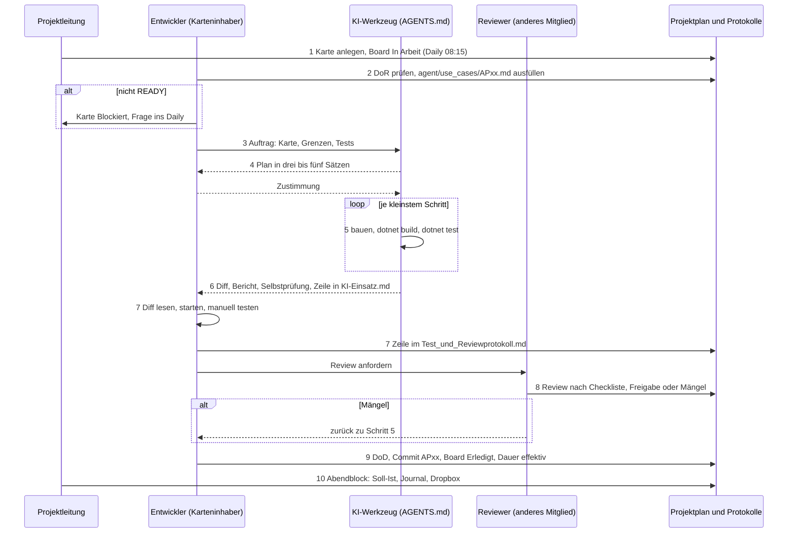

# Ablauf je Karte: wer macht was wann

Die Projektmethode für die Umsetzung mit KI (Kursunterlagen S. 18 f., Folie 10 "Projektmethode erklären"). Eine Karte ist ein Arbeitspaket aus dem Projektplan oder ein Teilschritt davon, höchstens ein Halbtag; fachlich ein freigegebener Use Case oder ein Teil davon. Vier Rollen: Projektleitung (Rod), Entwickler als Karteninhaber (Benjamin, Pascal, Rod), KI-Werkzeug nach `AGENTS.md`, Reviewer (ein anderes Gruppenmitglied als der Karteninhaber).

Das Bild dazu liegt im Projektordner unter `bilder\umsetzung\052_ablauf_je_karte.png` und im Konzept (Kapitel 15). Hier steht der Ablauf als Tabelle und als Mermaid-Sequenz, weil Text für Werkzeuge und Diffs besser lesbar ist als ein Bild.

## Die zehn Schritte

| Nr. | Wer | Wann | Was | Artefakt |
|---|---|---|---|---|
| 1 | Projektleitung | Daily 08:15 | Karte anlegen oder aus dem Plan ziehen, Verantwortlichen setzen, Board auf In Arbeit (WIP 2 je Person) | Zeile im Projektplan |
| 2 | Entwickler | vor dem ersten Auftrag | Definition of Ready prüfen, Karte nach `Use_Case_Karte_Vorlage.md` ausfüllen: Ziel, Abgrenzung, Komponenten, Akzeptanzkriterien, Schnittstellen, Tests. Nicht READY: Blockiert, klären | `agent/use_cases/APxx.md` |
| 3 | Entwickler | Start der Karte | Auftrag an das Werkzeug: Karte, Grenzen (was nicht angefasst wird), welche Tests grün sein müssen | Prompt mit Verweis auf die Karte |
| 4 | KI-Werkzeug | sofort | Plan in drei bis fünf Sätzen nennen und auf Zustimmung warten, wenn mehr als eine Datei betroffen ist | Plan im Chat |
| 5 | KI-Werkzeug | während der Arbeit | kleinste Schritte, nach jedem `dotnet build` und `dotnet test`; rot heisst Stopp und Bericht | grüner Testlauf |
| 6 | KI-Werkzeug | am Ende | Selbstprüfung nach `Review_Checkliste.md`, Bericht nach `AGENTS.md` Abschnitt 9 in die Kartendatei (Abschnitt Ergebnis), Diff, Zeile in `KI-Einsatz.md` | Diff, Bericht in `agent/use_cases/APxx.md`, KI-Einsatz |
| 7 | Entwickler | nach der Übergabe | Diff lesen und verstehen, Anwendung starten, manuelle Tests nach Karte, Zeile im Test- und Reviewprotokoll | `Test_und_Reviewprotokoll.md` |
| 8 | Reviewer | vor Erledigt | Review nach Checkliste; Pflicht bei Sicherheit, Architektur, schwer verständlichem Code, sonst Stichprobe; nie nur durch dasselbe KI-Werkzeug; Mängel zurück zu Schritt 5 | Zeile im Reviewprotokoll, Freigabe |
| 9 | Entwickler | nach Freigabe | Definition of Done prüfen, Commit mit Kartennummer und KI-Zeile, Board auf Erledigt, Dauer effektiv | Commit, Plan |
| 10 | Projektleitung | Abendblock 17:00 | Soll-Ist des Tages, Journal, Dropbox; Abweichungen entscheiden | Soll-Ist im Plan, Journal |

Zeitbudget je Karte: Schritt 2 und 3 zehn Minuten, Schritt 7 so lange wie das Lesen dauert, Schritt 8 zehn Minuten. Wer Schritt 7 überspringt, hat am Freitag Code, den er in der Präsentation nicht erklären kann (S. 19: jedes Mitglied kann zu seinen Teilen befragt werden).

## Dasselbe als Sequenz

## Grenzen, die nie fallen

- Kein Bauen ohne READY (Schritt 2). Kein Erledigt ohne Review (Schritt 8).
- Das Werkzeug gibt nie selbst frei; die Freigabe macht ein Mensch.
- Review und Erzeugung nicht durch dasselbe KI-Werkzeug.
- Abbruchkriterien in `AGENTS.md` Abschnitt 8 gelten in jedem Schritt.
