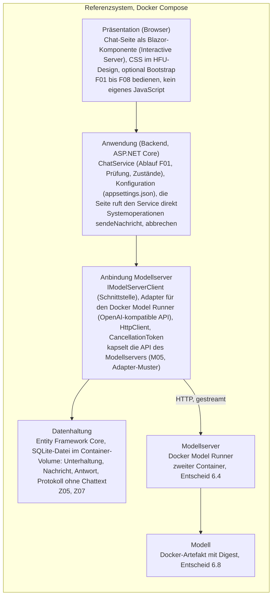
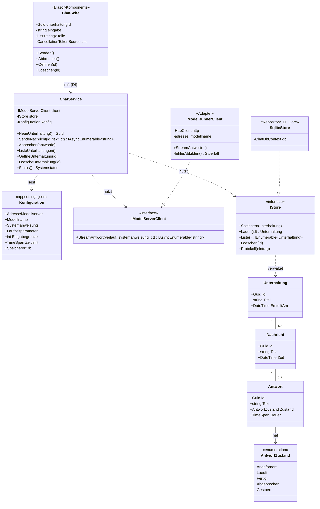
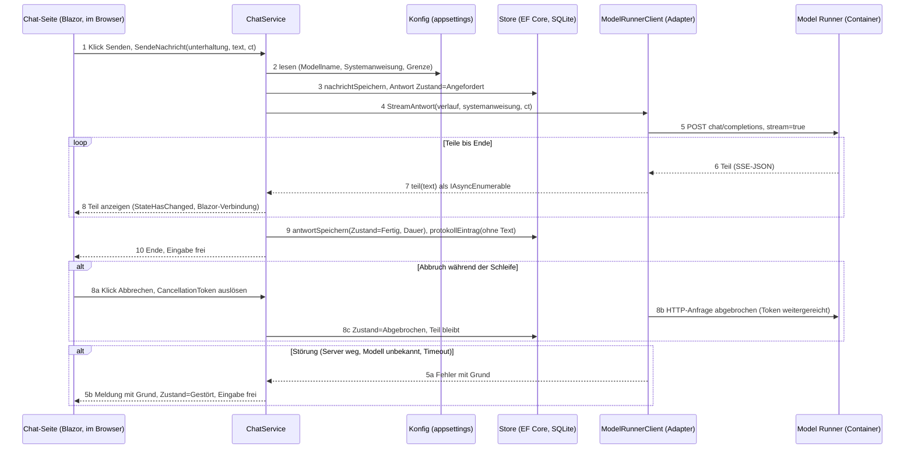
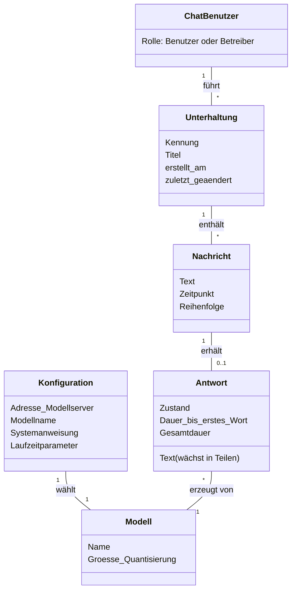
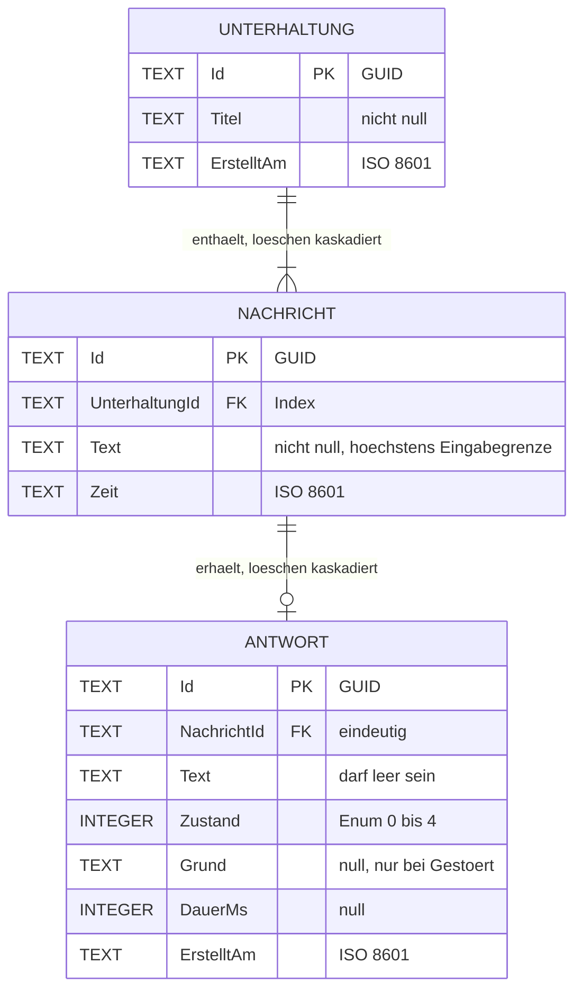

# Wie es gebaut wird: Architektur, Oberflaeche, Daten

> Auszug aus dem Konzept `20260921-010-RL-Konzept.docx` fuer Entwickler und KI-Werkzeuge. Das Konzept ist der Master; weicht die Umsetzung ab, wird zuerst das Konzept geaendert (Kapitel 14.3) und dann dieser Auszug neu exportiert. Stand des Exports: siehe Dateidatum.

# Architektur

Wie das System gebaut ist: Schichten und Komponenten, der Datenfluss vom Browser bis zum Modell, die Schnittstellen und das Konfigurationskonzept. Das Kapitel ist das Design zum Haupt-Use-Case F01 aus 4.7 und der Nachweis für M03; es muss stehen, bevor die Pakete AP07 und AP08 gebaut werden.

## Komponenten

Zielarchitektur des Auftraggebers: Die Kursunterlagen verlangen drei logisch getrennte Komponenten (S. 13, M03) und zeigen auf S. 7 eine mögliche Zielarchitektur. Zuordnung zu unseren Schichten: Chatfrontend = Präsentation (Chat-Seite als Blazor-Komponente im Browser); Backend-Gateway = Anwendung, Anbindung und Datenhaltung in einem Container; lokaler Modellserver = Docker Model Runner im zweiten Container mit dem Modell aus 6.8. Die Regel von S. 7 gilt unverändert: Das Frontend spricht nie direkt mit dem Modellserver, nur der Adapter kennt dessen API. Nachweis für M03 sind das Schichtenmodell in diesem Kapitel und die Design-Sequenz in 7.2; die Whiteboard-Skizze in 3.3 ist dieselbe Architektur auf Containerebene.

Das System besteht aus vier Schichten auf dem Referenzsystem und zwei mitgelieferten, nicht entwickelten Teilen. Abhängigkeiten zeigen nur nach unten: Die Präsentation kennt den Modellserver nicht, nur der Adapter kennt dessen API. Wird der Modellserver getauscht, ändern sich ein Adapter und die Konfiguration, sonst nichts.

TODO: Diagramm aktualisieren

Diagramm: Schichtenmodell des lokalen KI-Chats. Abhängigkeiten nur nach unten; Modellserver und Modell sind mitgeliefert, nicht entwickelt. (im Konzept als Bild, hier als Mermaid; Datei `047_schichtenmodell.png` im Ordner bilder des Projekts)

| Komponente | Schicht | Verantwortung | Schnittstelle | Technik (Kapitel 6) |
|----|----|----|----|----|
| Chat-Seite | Präsentation | F01 bis F08 bedienen: Eingabe, Anzeige in Teilen, Abbrechen, Liste der Unterhaltungen, Meldungen; Corporate Design, zwei Fensterbreiten | ruft nur IChatService | Blazor-Komponente (Interactive Server), CSS, optional Bootstrap; JavaScript nur für Sonderfälle |
| ChatService | Anwendung | Ablauf von F01 bis F06: Eingabe prüfen, Verlauf holen, Adapter aufrufen, Teile weiterreichen, Zustände der Antwort setzen, Protokolleintrag schreiben | IChatService (7.3) | C#, per Dependency Injection in die Seite |
| Konfiguration | Anwendung | Adresse des Modellservers, Modellname, Systemanweisung, Laufzeitparameter, Eingabegrenze, Zeitlimit; Prüfung beim Start | gelesen von ChatService und Adapter | appsettings.json, Umgebungsvariablen (7.4) |
| IModelServerClient und Adapter | Anbindung | kapselt die API des Modellservers: Anfrage senden, Teile empfangen, Abbruch weitergeben, Fehler auf vier Fälle abbilden | eine Schnittstelle, ein Adapter für den Docker Model Runner (OpenAI-kompatible API) | HttpClient, CancellationToken |
| Store | Datenhaltung | Unterhaltung, Nachricht, Antwort mit Zustand speichern, laden, löschen; Protokolleintrag ohne Chattext | IStore, vom ChatService | Entity Framework Core, SQLite-Datei im Container-Volume |
| Modellserver | mitgeliefert | lädt das Modell, erzeugt Text als Datenstrom | OpenAI-kompatible HTTP-API | Docker Model Runner (6.4), zweiter Container |
| Modell | mitgeliefert | die Gewichte | Docker-Artefakt mit Digest | Entscheid 6.8 |

Tabelle : Komponenten und Schichten

Bewusst weggelassen, weil kein Mussziel sie braucht: eigene Benutzerverwaltung (N04, höchstens K03), Vektordatenbank (N08), Zugriff über das Internet (N05). Jede Komponente im Bild bedient mindestens ein Mussziel (Empfehlung des Dozenten vom 21.09.).

Klassen: Das Klassendiagramm zeigt die Bausteine mit ihren Operationen und die Fachklassen aus dem Konzeptmodell (4.7). Unterhaltung, Nachricht und Antwort werden in 9.1 zu Tabellen; der Zustand der Antwort ist das Enum aus dem Zustandsdiagramm 4.7.6, die erlaubten Übergänge prüft der ChatService. Seite und Service kennen nur Schnittstellen (IModelServerClient, IStore); die Umsetzungen erhalten sie per Dependency Injection.

Diagramm: Design-Klassendiagramm F01: Bausteine, Fachklassen und Zustand (im Konzept als Bild, hier als Mermaid; Datei `051_klassendiagramm_f01.png` im Ordner bilder des Projekts)

Muster: Adapter, weil der Modellserver austauschbar bleiben muss (M05): ModelRunnerClient ist der einzige Baustein, der die API des Docker Model Runner kennt. Repository, weil die Datenhaltung hinter IStore liegt und in Tests durch einen Speicher im Arbeitsspeicher ersetzt werden kann. State, weil eine Antwort fünf Zustände mit festen Übergängen hat (4.7.6) und der Zustand als Feld gespeichert wird. Dependency Injection (Skript SE II, Kapitel 9), weil Seite und Service ihre Bausteine nicht selbst erzeugen; in ASP.NET Core ist das der Standardweg.

## Datenfluss Browser bis Modell

Der Datenfluss ist das Systemsequenzdiagramm aus 4.7, aufgelöst in die Bausteine aus 7.1. Jede Zeile hat dort ihren Ursprung: Zeile 1 und 8a sind die zwei Systemoperationen (sendeNachricht, abbrechen), Zeilen 2 bis 5 lösen Schritt 3 des Standardablaufs auf, die Schleife ist Schritt 4, Zeilen 9 und 10 sind Schritt 5 und 6.

Diagramm: Designmodell F01 mit echten Bausteinen: Streaming-Schleife, Abbruch, Störung (im Konzept als Bild, hier als Mermaid; Datei `048_design_sequenz_f01.png` im Ordner bilder des Projekts)

Streaming-Technik: Mit Blazor Interactive Server laufen Chat-Seite und ChatService im selben Prozess. Der Adapter liefert die Teile als IAsyncEnumerable\<string\>, der Service reicht sie durch, die Seite zeigt jeden Teil sofort an (StateHasChanged); der Browser erhält die Änderungen über die bestehende Blazor-Verbindung. Begründung (S. 8 verlangt sie): kein eigener HTTP-Endpunkt und kein zweiter Kanal nötig, Abbruch über einen CancellationToken, der bis zur HTTP-Anfrage an den Model Runner weitergereicht wird. Server-Sent Events oder ein gestreamter HTTP-Response wären nötig, wenn das Frontend ein eigenes Programm wäre; das ist hier nicht der Fall. Grenze: Bricht die Blazor-Verbindung ab, ist die Seite weg; die laufende Antwort wird als Gestört mit Grund Verbindungsverlust gespeichert. Zeitüberschreitung und nicht erreichbaren Modellserver behandelt der Adapter und liefert dem Service einen der vier Störfälle (M09). Rückfall, falls das Streaming nicht rechtzeitig läuft: ganze Antwort ohne Teile, gleicher Ablauf ohne Schleife.

## Schnittstellen

Frontend zu Backend: Die Chat-Seite spricht ausschliesslich mit IChatService. Das ist die dokumentierte Schnittstelle (M05), je Funktion eine Methode.

| Methode | Funktion | Eingabe | Ausgabe |
|----|----|----|----|
| NeueUnterhaltung() | F03 | keine | Kennung der Unterhaltung |
| SendeNachricht(unterhaltungId, text, ct) | F01 | Kennung, Text, Abbruch-Token | Datenstrom von Teilen (IAsyncEnumerable\<string\>); am Ende Zustand und Kennung der Antwort |
| Abbrechen(antwortId) | F02 | Kennung der Antwort | Zustand Abgebrochen; technisch löst die Seite den CancellationToken aus |
| ListeUnterhaltungen() | F04 | keine | Kennungen, Titel, Datum |
| OeffneUnterhaltung(id) | F04 | Kennung | Nachrichten und Antworten in Reihenfolge |
| LoescheUnterhaltung(id) | F05 | Kennung | Bestätigung |
| Status() | F06, K07 | keine | Modellserver erreichbar, Modellname, Konfiguration gültig |

Tabelle : Schnittstelle IChatService

Fehler kommen als Ausnahme mit einem der vier Fälle: Modellserver nicht erreichbar, Modell unbekannt, Konfiguration ungültig, Zeitüberschreitung. Die Seite zeigt die Meldung mit Grund (M09), die Eingabe bleibt frei. Ein HTTP-Endpunkt GET /status mit demselben Inhalt wie Status() dient Betrieb und Tests; die Chat-Funktion selbst braucht keinen.

Backend zu Modellserver: die OpenAI-kompatible API des Docker Model Runner, hinter IModelServerClient. Der Adapter sendet POST auf chat/completions mit Modellname, Systemanweisung und Verlauf, stream=true, und liest die Teile als Server-Sent Events. Adresse und Modellname kommen aus der Konfiguration; aus dem Anwendungs-Container ist der Model Runner unter http://model-runner.docker.internal erreichbar, vom Host über den in Docker Desktop freigegebenen TCP-Port \[Adresse im Spike prüfen\]. Nur der Adapter kennt diese Adresse.

## Konfigurationskonzept

| Wert | Wo | Beispiel (Platzhalter) | Wirkung |
|----|----|----|----|
| Adresse Modellserver | appsettings.json, überschreibbar per Umgebungsvariable | http://model-runner.docker.internal/engines/v1 | Adapter |
| Modellname | dito | Name des Modells aus 6.8 | Anfrage an den Model Runner |
| Systemanweisung | dito | «Du bist ein Assistent der HFU Uster …» | jeder Anfrage vorangestellt |
| Laufzeitparameter | dito | Temperatur, maximale Antwortlänge | Anfrage |
| Eingabegrenze | dito | 4000 Zeichen \[Entscheid offen\] | Prüfung in Schritt 2 des Standardablaufs |
| Zeitlimit | dito | 60 Sekunden | Störfall Zeitüberschreitung |
| Speicherort SQLite | dito | /data/chat.db im Docker-Volume | Store |
| Protokolldatei | dito | /data/protokoll.log | 9.3 |

Tabelle : Konfigurationswerte

Regeln (S. 9, S. 12): keine Geheimnisse und keine persönlichen Pfade im Code; die mitgelieferte Beispieldatei enthält nur Platzhalter; eine Änderung wirkt nach Neustart des Containers ohne Neubau (Z02). Die Konfiguration wird beim Start geprüft; ein ungültiger Wert ist der Störfall Konfiguration ungültig und wird dem Betreiber in Status() und auf der Seite genannt (F06, F07).

# UI-Konzept

Wie die Chatoberfläche aussieht und bedient wird: das Mockup mit den sieben Bedienabläufen von S. 12 der Kursunterlagen und die Umsetzung des Corporate Designs der HFU (M07).

## Mockup

Das Mockup zeigt eine Seite mit drei Bereichen: links die Liste der Unterhaltungen mit Titel und Datum (F03, F04, F05), in der Mitte der Verlauf mit Nachrichten und Antworten, unten das Eingabefeld mit einem Knopf, der je nach Zustand Senden oder Abbrechen heisst (F01, F02). Eine Statuszeile über dem Eingabefeld zeigt Meldungen mit Grund (F06). Die sieben Bedienabläufe von S. 12 sind damit je einem Element zugeordnet. Zwei Fensterbreiten: die Liste klappt auf schmalen Bildschirmen ein. Handskizze: \[Pascal, AP08\].

## Corporate-Design

Logo, Farben und Schrift kommen aus den bereitgestellten Gestaltungselementen (\_Logos; Frage A1 klärt den Umfang). Farben und Schrift liegen als CSS-Variablen an einer Stelle, das Logo steht im Seitenkopf. Die Prüfung ist ein Testfall in 11.3 (M07).

# Datenhaltung

Welche Daten wo gespeichert werden, wie eine Unterhaltung eindeutig ist, was bei Löschung und Neustart geschieht und warum technische Protokolle vom Chattext getrennt bleiben (S. 9). Grundlage ist das konzeptionelle Modell aus der Analyse; daraus werden die Tabellen.

## Welche Daten, wo

Gespeichert werden Unterhaltung (Kennung, Titel, Erstellt am), Nachricht (Kennung, Unterhaltung, Text, Zeit) und Antwort (Kennung, Nachricht, Text, Zustand, Dauer). Das konzeptionelle Modell aus der Analyse ist die Vorlage: jede Klasse wird eine Tabelle, jede Beziehung ein Fremdschlüssel.

Diagramm: Konzeptionelles Modell: aus den Klassen werden Tabellen, aus den Attributen Felder (im Konzept als Bild, hier als Mermaid; Datei `046_konzeptmodell.png` im Ordner bilder des Projekts)

Speicherort: eine SQLite-Datei über Entity Framework Core (Entscheid 6.4), im Docker-Volume, damit sie den Neustart des Containers überlebt. Der Browser speichert nichts. Das Entity-Relationship-Modell: jede Klasse des Konzeptmodells wird eine Tabelle, jede Beziehung ein Fremdschlüssel, der Zustand der Antwort ein Enum als Zahl. Die Tabellen entstehen aus den Klassen (Code First); die Migration «Initial» wird in AP09 erzeugt, das Bild ist die Vorgabe dafür.

Diagramm: Entity-Relationship-Modell: drei Tabellen, zwei Beziehungen mit Kaskade, Zustand als Enum (im Konzept als Bild, hier als Mermaid; Datei `054_erm.png` im Ordner bilder des Projekts)

| Tabelle | Feld | Typ in SQLite | Schlüssel und Regel |
|----|----|----|----|
| Unterhaltung | Id | TEXT (GUID) | Primärschlüssel, beim Anlegen erzeugt |
| Unterhaltung | Titel | TEXT, nicht null | Anfang der ersten Nachricht, änderbar |
| Unterhaltung | ErstelltAm | TEXT (ISO 8601) | Sortierung der Liste (F04) |
| Nachricht | Id | TEXT (GUID) | Primärschlüssel |
| Nachricht | UnterhaltungId | TEXT | Fremdschlüssel auf Unterhaltung, Index, Löschen kaskadiert |
| Nachricht | Text | TEXT, nicht null | höchstens Eingabegrenze (7.4) |
| Nachricht | Zeit | TEXT (ISO 8601) | Reihenfolge im Verlauf |
| Antwort | Id | TEXT (GUID) | Primärschlüssel |
| Antwort | NachrichtId | TEXT | Fremdschlüssel auf Nachricht, eindeutig (eine Antwort je Nachricht), Löschen kaskadiert |
| Antwort | Text | TEXT, darf leer sein | wächst mit den Teilen; bei Abbruch bleibt der Teil |
| Antwort | Zustand | INTEGER | Enum AntwortZustand: 0 Angefordert, 1 Läuft, 2 Fertig, 3 Abgebrochen, 4 Gestört (4.7.6) |
| Antwort | Grund | TEXT, null | nur bei Gestört: einer der vier Störfälle mit Text |
| Antwort | DauerMs | INTEGER, null | Gesamtdauer, für die Messung (11.4) |
| Antwort | ErstelltAm | TEXT (ISO 8601) | Beginn der Anfrage |

Tabelle : Tabellen und Felder der SQLite-Datenbank

Nicht in der Datenbank: der Protokolleintrag (9.3, eigene Datei ohne Chattext) und die Konfiguration (7.4, appsettings.json). Beim Neustart wird jede Antwort im Zustand Angefordert oder Läuft auf Gestört mit Grund «Neustart» gesetzt (9.2), damit kein Zustand ohne laufende Anfrage existiert.

## Kennung, Löschung, Neustart

Kennung: jede Unterhaltung, Nachricht und Antwort erhält beim Anlegen eine GUID; der Titel der Unterhaltung ist der Anfang der ersten Nachricht und kann geändert werden. Löschung: F05 entfernt die Unterhaltung mit allen Nachrichten und Antworten (Kaskade); der Protokolleintrag bleibt, weil er keinen Chattext enthält. Neustart: die Datei bleibt im Volume, die Liste wird beim Start geladen; eine Antwort, die beim Neustart noch lief, wird als Gestört mit Grund Neustart gespeichert, damit kein Zustand Läuft ohne laufende Anfrage existiert.

## Technische Logs getrennt von Chatdaten

Das technische Protokoll steht in einer eigenen Datei im Volume (7.4), ein Eintrag je Anfrage: Zeit, Kennung der Unterhaltung, Modellname, Dauer bis zum ersten Teil, Gesamtdauer, Anzahl Zeichen, Endzustand und bei Störung der Grund. Kein Chattext, keine Systemanweisung (S. 9). Zweck: Messung für M11 (11.4) und Fehlersuche; die Datei kann ohne Rücksicht auf Inhalte weitergegeben werden.

