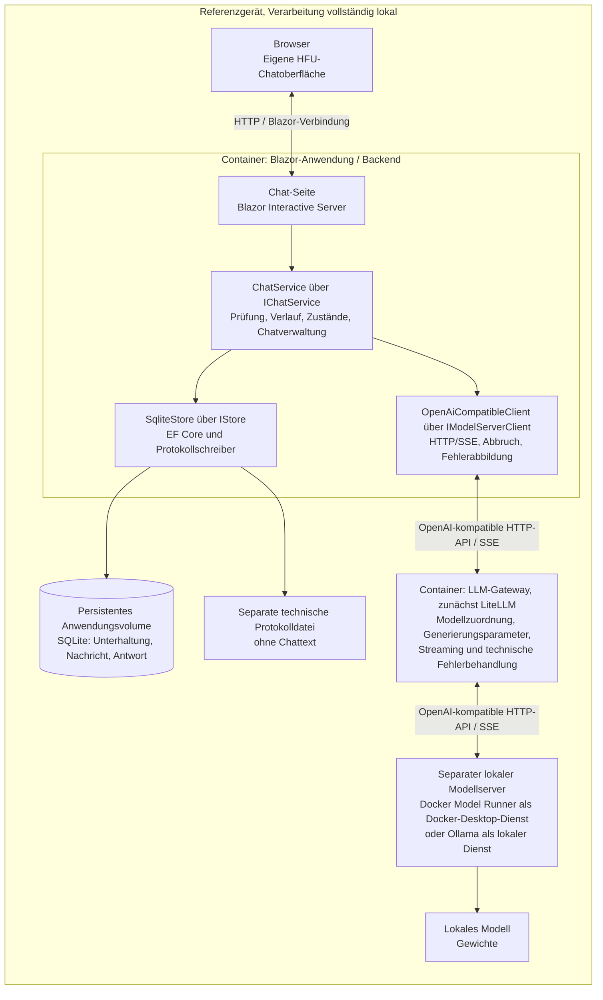
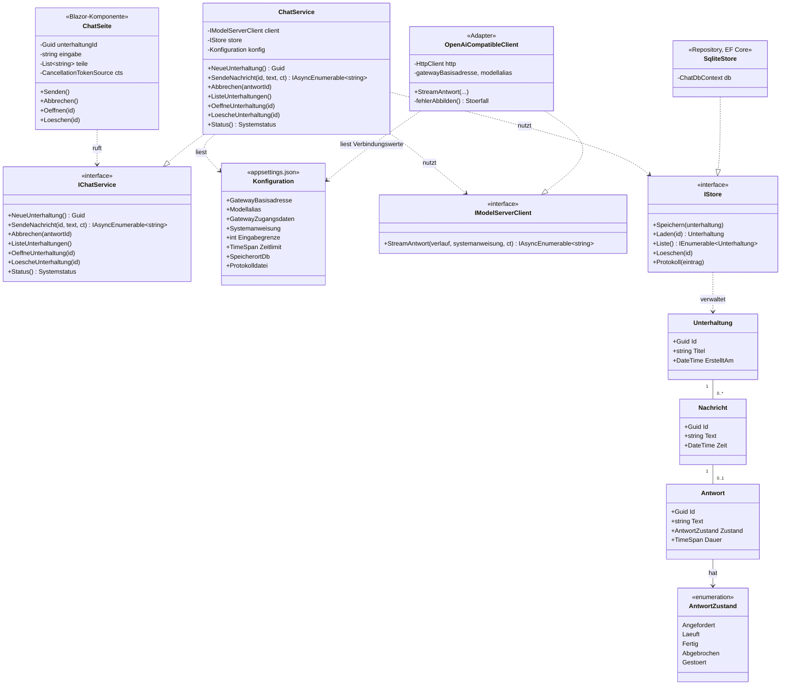
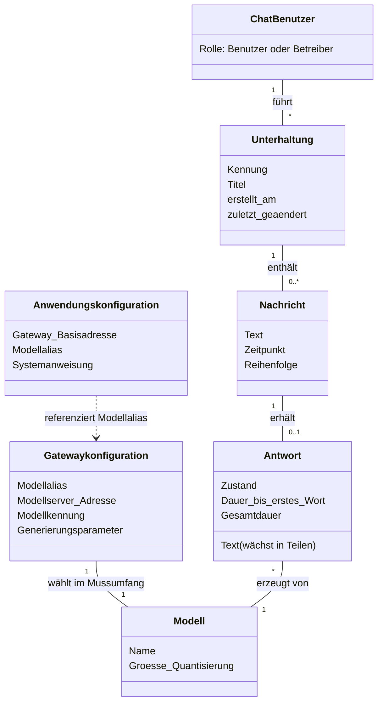

# Wie es gebaut wird: Architektur, Oberflaeche, Daten

> Zielbild vom 23.09.2026 für Entwickler und KI-Werkzeuge, überarbeitet gemäss dem freigegebenen Refactoring-Plan auf Grundlage von `agent/Use_Cases.md` und der bereitgestellten Architekturskizze. Dieses Dokument ist damit kein unveränderter Konzeptauszug mehr. Das Konzept `20260921-010-RL-Konzept.docx` bleibt der Master; der Abgleich und die Übernahme der Architekturänderung durch die Gruppe in Kapitel 7 und 14.3 stehen noch aus. Dieser Auftrag ändert ausschliesslich `agent/Design.md`, keinen Code und keine Betriebskonfiguration. Offene Dokumentabgleiche stehen am Ende.

# Architektur

Wie das System gebaut ist: Schichten und Komponenten, der Datenfluss vom Browser bis zum Modell, die Schnittstellen und das Konfigurationskonzept. Das Kapitel ist das Design zum Haupt-Use-Case F01 aus 4.7 und der Nachweis für M03; es muss stehen, bevor die Pakete AP07 und AP08 gebaut werden.

## Komponenten

Die drei logisch getrennten Verantwortungsbereiche aus M03 bleiben erkennbar: Chatfrontend, Backend und lokaler Modellserver. Das Backend der eigenen Anwendung wird durch ein separat betriebenes LLM-Gateway ergänzt. LiteLLM ist die gewählte Gateway-Umsetzung; Docker Model Runner oder Ollama stellt den lokalen Modellserver bereit. Beide sind austauschbare Infrastruktur, keine Bestandteile der Fachlogik.

Die Anwendung enthält Präsentation, Anwendungslogik, einen neutralen LLM-Client und Datenhaltung. Die vollständig selbst entwickelte Chat-Seite verwendet Blazor Interactive Server: Ihre Komponentenlogik läuft zusammen mit dem ChatService im Anwendungsprozess; der Browser empfängt die Anzeige über die Blazor-Verbindung. Die Seite kennt ausschliesslich IChatService. Der ChatService nutzt IModelServerClient und IStore unabhängig voneinander. Der LLM-Client greift nie auf den Store zu.

Auf dem Referenzgerät laufen die Blazor-Anwendung und LiteLLM in getrennten Containern. SQLite liegt im persistenten Volume der Anwendung und ist kein eigener Server. Der Modellserver läuft gemäss Zielbild separat auf demselben Gerät: Docker Model Runner als von Docker Desktop bereitgestellter Dienst oder Ollama als lokaler Dienst. Er wird nicht als zweiter Anwendungscontainer vorausgesetzt. Nur die Weboberfläche wird für den lokalen Browser veröffentlicht; Gateway und Modellserver benötigen keinen öffentlichen Internetzugang.

Diagramm: Komponenten, Prozessgrenzen und Aufrufwege des Zielbilds. Ersetzt hier die Darstellung zu `047_schichtenmodell.png`; das Bild im Konzept ist noch abzugleichen.



| Komponente | Schicht | Verantwortung | Schnittstelle | Technik im Zielbild |
|----|----|----|----|----|
| Chat-Seite | Präsentation | F01 bis F06 bedienen: Eingabe, Streaming anzeigen, Abbrechen, Unterhaltungen anlegen, auswählen und löschen, Meldungen; HFU-Design | ruft nur IChatService | eigene Blazor-Komponente (Interactive Server), CSS, optional Bootstrap |
| ChatService | Anwendung | Eingabe prüfen, Verlauf und Systemanweisung zusammensetzen, Client aufrufen, Teile weiterreichen, Antwortzustände setzen, Chatverwaltung und Speicherung steuern, Anfrageprotokoll veranlassen | IChatService; nutzt IModelServerClient und IStore | C#, Dependency Injection |
| Anwendungskonfiguration | Anwendung / Anbindung | Gateway-Basisadresse, Modellalias, gegebenenfalls Zugangsdaten; Systemanweisung, Eingabegrenze, Gesamtzeitlimit und Speicherpfade | ChatService und Client lesen jeweils ihre Werte | appsettings.json und Umgebungsvariablen |
| IModelServerClient / OpenAiCompatibleClient | Anbindung | neutraler HTTP/SSE-Client zum Gateway: Textteile lesen, Abbruch weitergeben, Transport- und Gatewayfehler in Störfälle übersetzen | produktneutrale Schnittstelle; OpenAI-kompatible Chat-Completions-API | HttpClient, CancellationToken; kein LiteLLM-SDK |
| IStore / SqliteStore | Datenhaltung | Unterhaltung, Nachricht und Antwort speichern, laden und löschen; technische Einträge in separate Datei schreiben | IStore, ausschliesslich vom ChatService genutzt | Entity Framework Core, SQLite und Protokolldatei im persistenten Volume |
| LLM-Gateway | mitgelieferte Infrastruktur | Modellserver kapseln, Modellalias auf Zielmodell abbilden, Generierungsparameter und technische Zeitlimits verwalten, Streaming vermitteln, technische Modellserverfehler behandeln | OpenAI-kompatible HTTP-API; Administration getrennt vom Chat | zunächst LiteLLM im eigenen Container |
| Modellserver | mitgelieferte Infrastruktur | Modell laden, Text erzeugen und streamen | OpenAI-kompatible HTTP-API zum Gateway | Docker Model Runner oder Ollama auf dem Referenzgerät |
| Modell | mitgeliefert | lokale Modellgewichte | vom Modellserver geladen | Modellwahl gemäss Konzept 6.8; Bereitstellung passend zum gewählten Modellserver |

Tabelle : Komponenten und Schichten

F07 (Konfiguration ändern) und F08 (technisches Protokoll einsehen) sind Betreiberfunktionen. Dafür sind Konfigurationsdateien, gegebenenfalls die LiteLLM-Admin-UI und die technische Protokolldatei vorgesehen; eine eigene Administrationsoberfläche ist nicht erforderlich. Eine Modellauswahl durch Chat-Benutzer bleibt K01. Eigene Benutzerverwaltung, Vektordatenbank, externe KI-Dienste und Betrieb über das Internet gehören nicht zum Mussumfang.

Klassen: Das Klassendiagramm zeigt die Bausteine der eigenen Anwendung. Die Seite kennt IChatService, der ChatService kennt IModelServerClient und IStore; die Umsetzungen werden per Dependency Injection zugewiesen. LiteLLM ist ein externer Prozess und keine Klasse der Fachlogik. Unterhaltung, Nachricht und Antwort werden zu Tabellen. Antwortzustände und Übergänge verwaltet ausschliesslich der ChatService. Die Methodennamen folgen hier der Konzeptnotation; im Code tragen asynchrone Methoden das Suffix Async.

Diagramm: Design-Klassendiagramm F01 im Zielbild: Bausteine, Fachklassen und Zustand. Die Darstellung zu `051_klassendiagramm_f01.png` im Konzept ist noch abzugleichen.



Muster: Der Adapter OpenAiCompatibleClient kapselt das gemeinsame OpenAI-kompatible Protokoll, nicht die Besonderheiten eines bestimmten Modellservers. Dessen Anbindung und Konfiguration übernimmt das Gateway. Ein Austausch erfordert bei Einhaltung des unten beschriebenen Vertrags keine Änderung am Anwendungscode (Z02). Repository trennt die Datenhaltung hinter IStore ab. Die Zustandsmaschine mit fünf Antwortzuständen liegt im ChatService; Zustand und Text werden gespeichert. Dependency Injection erlaubt in Tests einen Fake-Client und einen Store im Arbeitsspeicher.

## Datenfluss Browser bis Modell

Der Datenfluss löst F01 aus `agent/Use_Cases.md` in die Bausteine des Zielbilds auf. Der ChatService prüft zuerst die Eingabe. Leerer Text wird mit einem Hinweis abgewiesen, zu langer Text mit Angabe der Grenze; es erfolgt kein Aufruf des Clients. Bei gültiger Eingabe lädt der Service den bisherigen Verlauf, setzt die Systemanweisung davor und nimmt die neue Nachricht genau einmal auf. Systemanweisung, Benutzertexte und bisherige Antworten bleiben dabei nach Rollen getrennt.

Diagramm: Designmodell F01 im Zielbild mit Streaming, Abbruch und Störungen. Die Darstellung zu `048_design_sequenz_f01.png` im Konzept ist noch abzugleichen.

```mermaid
sequenceDiagram
    participant B as Browser
    participant P as Chat-Seite (serverseitig)
    participant S as ChatService
    participant ST as Store (EF Core, SQLite)
    participant A as OpenAiCompatibleClient
    participant G as LLM-Gateway (LiteLLM)
    participant M as Lokaler Modellserver
    B->>P: Senden über Blazor-Verbindung
    P->>S: SendeNachricht(unterhaltungId, text, ct)
    S->>S: Eingabe und Anwendungskonfiguration prüfen
    alt Eingabe leer, zu lang oder Konfiguration ungültig
        S-->>P: Hinweis oder Störfall, kein Client-Aufruf
        P-->>B: Meldung, Eingabe bleibt erhalten und frei
    else Anfrage zulässig
        S->>ST: Bisherigen Verlauf laden
        ST-->>S: Nachrichten und Antworten in Reihenfolge
        S->>S: Verlauf und Systemanweisung zusammensetzen
        S->>ST: Nachricht und Antwort mit Zustand Angefordert speichern
        Note over B,P: Die Seite zeigt den eigenen Eingabetext als Nachricht und sperrt Senden; Abbrechen bleibt verfügbar.
        S->>A: StreamAntwort(verlauf, systemanweisung, ct)
        A->>G: POST chat/completions, Modellalias, messages, stream=true
        G->>M: Zielmodell und Generierungsparameter, stream=true
        loop Solange Textteile eintreffen und die Anfrage aktiv ist
            M-->>G: Antwortteil
            G-->>A: OpenAI-kompatibles SSE-Ereignis
            A-->>S: Textteil als IAsyncEnumerable
            S->>S: Ab erstem Textteil Zustand Laeuft, Text sammeln
            S-->>P: Textteil
            P-->>B: Anzeige über Blazor-Verbindung aktualisieren
        end
        alt Reguläres Streamende
            G-->>A: Regulärer Abschluss des SSE-Streams
            A-->>S: Enumeration erfolgreich beendet
            S->>ST: Antwort mit Text, Zustand Fertig und Dauer speichern
        else Benutzerabbruch vor oder nach dem ersten Teil
            B->>P: Abbrechen
            P->>S: CancellationToken auslösen
            S->>A: Abbruch weitergeben
            A->>G: HTTP-Anfrage und Stream schliessen
            G->>M: Laufende Modellanfrage abbrechen
            S->>ST: Teiltext, gegebenenfalls leer, als Abgebrochen speichern
        else Störung vor oder während der Ausgabe
            Note over A,M: Gateway-/Modellserverfehler oder unterbrochener Stream
            A-->>S: Störfall mit bereinigtem Grund
            S->>ST: Teiltext als Gestoert speichern
            S-->>P: Verständliche Meldung mit Grund
        else Gesamtzeitlimit oder endgültiger Blazor-Verbindungsverlust
            S->>A: Laufende Anfrage abbrechen
            A->>G: HTTP-Anfrage und Stream schliessen
            G->>M: Laufende Modellanfrage abbrechen
            S->>ST: Teiltext als Gestoert speichern
            S-->>P: Grund, sofern die Seite noch verbunden ist
        end
        S->>ST: Technischer Protokolleintrag ohne Chattext
        S-->>P: Anfrage abgeschlossen, Endzustand im Store
        P-->>B: Eingabe freigeben, sofern verbunden
    end
```

Die Alternativen im Diagramm sind mögliche Ausgänge derselben Anfrage. Abbruch und Störungen können bereits beim Verbindungsaufbau oder zwischen beliebigen Textteilen eintreten; nach einem Endzustand werden keine weiteren Teile übernommen. Der ChatService speichert genau einen Endzustand und veranlasst einen technischen Abschlusseintrag.

Streaming-Technik: Der Client liest SSE vom Gateway und liefert Textteile als `IAsyncEnumerable<string>`. Der Service reicht diese an die Blazor-Komponente weiter; sie aktualisiert die Anzeige mit StateHasChanged über die bestehende Blazor-Verbindung. Zwischen Chat-Seite und Service ist kein eigener Chat-HTTP-Endpunkt nötig. SSE wird zwischen Client, Gateway und Modellserver verwendet, nicht als zusätzlicher Browserkanal. Streaming ist für Z03 verpflichtend; eine vollständige Antwort erst am Ende anzuzeigen erfüllt die Anforderung nicht.

Abbruch: Ein Benutzerabbruch löst den CancellationToken der laufenden Anfrage aus. Der Client schliesst die HTTP-Anfrage; das Gateway muss die laufende Modellanfrage ebenfalls abbrechen. Das Schliessen des lokalen Streams allein beweist noch keinen Stopp der Modellerzeugung. Die Weitergabe über beide Prozessgrenzen ist deshalb für jede eingesetzte Kombination aus Gateway und Modellserver durch einen Integrationstest nachzuweisen. Teilantwort und Zustand Abgebrochen werden auch bei noch leerem Text gespeichert. Die abschliessende Speicherung darf nicht durch den bereits ausgelösten Anfrage-Token verhindert werden.

Zeitlimit und Verbindung: Das Gesamtzeitlimit verantwortet der ChatService, technische Verbindungszeitlimits das Gateway beziehungsweise der HTTP-Client. Die Abbruchursache bleibt unterscheidbar: Benutzerabbruch ergibt Abgebrochen, Zeitüberschreitung ergibt Gestoert. Ein Stream ohne regulären Abschluss ergibt ebenfalls Gestoert; bereits gelieferte Teile bleiben erhalten. Bei endgültigem Verlust der Blazor-Verbindung wird die Anfrage beendet und als Gestoert mit Grund Verbindungsverlust gespeichert; nach erneutem Öffnen ist der Zustand sichtbar. Automatische Wiederholungen und Modell-Fallbacks sind standardmässig in Client und Gateway deaktiviert, damit eine Anfrage nicht unbemerkt doppelt ausgeführt wird.

Bedienung und Zustände: Nach Erfolg, Abbruch oder behandelter Störung ist die Eingabe wieder frei. Bei Nichterreichbarkeit bleibt der gesendete Text gemäss F01-Erweiterung 3a im Eingabefeld erhalten. Neben den bisherigen Übergängen muss F02 auch Abbruch vor dem ersten Teil erlauben: Angefordert → Abgebrochen. Dieser in der bisherigen Zustandszeichnung fehlende Übergang ist im Masterkonzept nachzuführen; er ist hier ausdrücklich beschrieben und nicht als bereits abgeglichen behauptet.

## Schnittstellen

Frontend zu Backend: Die Chat-Seite spricht ausschliesslich mit IChatService. Das ist die dokumentierte Schnittstelle (M05), je Funktion eine Methode.

| Methode | Funktion | Eingabe | Ausgabe |
|----|----|----|----|
| NeueUnterhaltung() | F03 | keine | Kennung der Unterhaltung |
| SendeNachricht(unterhaltungId, text, ct) | F01 | Kennung, Text, Abbruch-Token | `IAsyncEnumerable<string>` mit Textteilen; Antwortkennung und Endzustand stehen im Store und sind über OeffneUnterhaltung lesbar |
| Abbrechen(antwortId) | F02 | Kennung der Antwort | Zustand Abgebrochen; technisch löst die Seite den CancellationToken aus |
| ListeUnterhaltungen() | F04 | keine | Kennungen, Titel, Datum |
| OeffneUnterhaltung(id) | F04 | Kennung | Nachrichten und Antworten in Reihenfolge |
| LoescheUnterhaltung(id) | F05 | Kennung | Bestätigung |
| Status() | F06, K07 | keine | Zustand der Modellanbindung über das Gateway, konfigurierter Modellalias, Gültigkeit der Anwendungskonfiguration |

Tabelle : Schnittstelle IChatService

Die bestehenden Operationen von IChatService und IStore bleiben erhalten. Abbrechen bezeichnet die fachliche Operation; technisch wird der Token der betreffenden aktiven Anfrage ausgelöst, kein zusätzlicher produktspezifischer Abbruchendpunkt. Status() beschreibt die über das Gateway beobachtete Modellanbindung; ein erreichbarer Gateway-Prozess allein beweist keine erfolgreiche Modellerzeugung. Die Anwendung verwendet keine LiteLLM-Verwaltungs- oder Health-Endpunkte. Der in `agent/Schnittstellen.md` noch als AP06-Entscheid markierte eigene Endpunkt `GET /status` bleibt ein offener Betriebsentscheid; für den Chat ist er nicht erforderlich.

### Anwendung zu LLM-Gateway

IModelServerClient bleibt die produktneutrale Schnittstelle mit `StreamAntwortAsync(verlauf, systemanweisung, ct)` und `IAsyncEnumerable<string>` als Ausgabe. Die Umsetzung heisst OpenAiCompatibleClient. UI und Fachlogik verwenden keine LiteLLM-SDKs, LiteLLM-Datentypen oder Modellserverdetails. Der Client kennt nur den folgenden gemeinsamen HTTP-Vertrag:

| Bestandteil | Vertrag |
|----|----|
| Ziel | Konfigurierbare API-Basisadresse einschliesslich API-Präfix; daran relativ `POST chat/completions` |
| Anfrage | JSON mit `model` als logischem Modellalias, `messages` mit den Rollen system, user und assistant sowie `stream=true` |
| Verlauf | Systemanweisung einmal voranstellen, danach den vom ChatService aufgebauten Verlauf einschliesslich der neuen Nachricht senden; das Gateway verwaltet keine Unterhaltung |
| Generierungsparameter | Im Gateway konfiguriert; die Anwendung überschreibt Temperatur und maximale Antwortlänge nicht |
| Antwort | SSE-Ereignisse im OpenAI-kompatiblen Chat-Completions-Format; Text aus `choices[].delta.content`, Abschlussinformation und reguläres Streamende (`[DONE]`) auswerten |
| Auswertung | Ereignisse ohne Text, etwa Rollen- oder Nutzungsinformationen, erzeugen keinen sichtbaren Text; ein Verbindungsende ohne regulären Abschluss ist ein Störfall |
| Authentifizierung | Falls erforderlich, Standardheader `Authorization: Bearer ...` aus serverseitiger Konfiguration; keine Gateway- oder Modellzugangsdaten im Browser |
| Abbruch | HTTP-Anfrage schliessen; das Gateway muss den Abbruch an den Modellserver weitergeben |

Das Gateway spricht ebenfalls über eine OpenAI-kompatible Chat-Completions-Schnittstelle mit dem lokalen Modellserver. Die jeweilige API-Basisadresse, tatsächliche Modellkennung und nötige Anpassungen liegen ausschliesslich in der Gateway-Konfiguration. Das OpenAI-kompatible Format beschreibt ein Protokoll und bedeutet keinen Aufruf des externen OpenAI-Dienstes. Die konkrete Unterstützung des gemeinsamen Funktionsumfangs wird für jede Gateway-/Modellserverkombination geprüft. Siehe [LiteLLM: OpenAI-kompatible Endpunkte](https://docs.litellm.ai/docs/providers/openai_compatible), [Docker Model Runner: API](https://docs.docker.com/ai/model-runner/api-reference/) und [Ollama: OpenAI-Kompatibilität](https://docs.ollama.com/api/openai-compatibility).

### Technische Fehler und fachliche Störfälle

Das Gateway behandelt technische Fehler der Modellanbindung und liefert sie über seine HTTP-/Streaming-Schnittstelle. Der Client behandelt zusätzlich Fehler auf dem Weg zum Gateway und übersetzt sie in die bestehende `StoerfallException`. Der ChatService entscheidet über Zustand, Speicherung und verständliche Meldung. Es werden keine neuen Störfallkategorien benötigt:

| Bestehender Störfall | Zuordnung im Zielbild |
|----|----|
| ModellserverNichtErreichbar | Gateway nicht erreichbar, Modellserver hinter dem Gateway nicht erreichbar oder Verbindung/Stream unerwartet unterbrochen; der bereinigte Grund unterscheidet die betroffene Verbindung, soweit bekannt |
| ModellUnbekannt | Gateway meldet unbekannten Modellalias oder unbekanntes Zielmodell |
| KonfigurationUngueltig | Ungültige Anwendungskonfiguration, falsche API-Basisadresse, fehlende beziehungsweise abgewiesene Zugangsdaten oder fehlerhafte Gateway-/Modellkonfiguration |
| Zeitueberschreitung | Technisches Zeitlimit oder Gesamtzeitlimit der Anfrage erreicht |

HTTP-Status allein identifiziert nicht immer den fachlichen Grund: Ein 404 kann beispielsweise eine falsche Route oder ein unbekanntes Modell betreffen. Der Client wertet Status und verfügbare standardisierte Fehlerinformationen aus, ohne LiteLLM-spezifische Fehlertypen vorauszusetzen. Ein nicht eindeutig zuordenbarer technischer Ausfall wird als ModellserverNichtErreichbar mit einem neutralen Grund zur fehlgeschlagenen Modellanbindung behandelt. Benutzerabbruch ist kein Störfall. Rohe Fehlerantworten, Stacktraces, Zugangsdaten und möglicherweise darin enthaltene Chattexte werden weder an die UI noch in technische Protokolle übernommen. Bei Konfigurationsfehlern wird der betroffene Wertname genannt, nicht ein geheimes oder vertrauliches Wertfragment.

## Konfigurationskonzept

| Wert | Verantwortung / Ablage | Wirkung |
|----|----|----|
| GatewayBasisadresse | Anwendung: appsettings.json, überschreibbar per Umgebungsvariable | API-Basisadresse des austauschbaren Gateways, einschliesslich API-Präfix |
| Modellalias | Anwendung: dito | Logischer Name im Anfragefeld model; keine produktspezifische Modellkennung |
| GatewayZugangsdaten, falls erforderlich | Anwendung: serverseitige Umgebung, keine echten Werte im Repository | Authentifizierung des Clients gegenüber dem Gateway |
| Systemanweisung | Anwendung: appsettings.json oder Umgebungsvariable | Vom ChatService jeder Anfrage genau einmal vorangestellt |
| Eingabegrenze | Anwendung: dito | Prüfung vor dem Client-Aufruf; bisheriger Vorschlag 4000 Zeichen bleibt ein offener Konzeptentscheid |
| Zeitlimit | Anwendung: dito | Gesamtzeitlimit der Anfrage; bisheriger Konzeptwert 60 Sekunden |
| SpeicherortDb und Protokolldatei | Anwendung: dito | SQLite und separate technische Protokolldatei im persistenten Anwendungsvolume |
| Zuordnung Modellalias zu Zielmodell | Gateway-Konfiguration | Stabile Sicht der Anwendung trotz Wechsel des tatsächlichen Modells |
| Modellserver-Adresse, Modellkennung und nötige Zugangsdaten | Gateway-Konfiguration / serverseitige Umgebung | Verbindung vom Gateway zum lokalen Modellserver |
| Temperatur und maximale Antwortlänge | Gateway-Konfiguration | Generierungsparameter des zugeordneten Modells |
| Technische Zeitlimits, Routing und Fehlerbehandlung | Gateway-Konfiguration | Modellanbindung; automatische Wiederholungen und Modell-Fallbacks standardmässig deaktiviert |

Tabelle : Konfigurationswerte

Die Anwendungskonfiguration bleibt ausserhalb des Sourcecodes in appsettings.json und Umgebungsvariablen. Die Tabelle benennt die Zuständigkeiten des Zielbilds; bestehende Konfigurationsdateien werden in diesem Dokumentauftrag nicht umgestellt. Keine Geheimnisse und keine persönlichen Pfade im Code oder in eingecheckten Konfigurationen; Beispiele enthalten nur Platzhalter. Anwendungseinstellungen werden beim Start geprüft. Eine ungültige Chatkonfiguration verhindert Modellanfragen und wird über Status() und die Seite verständlich gemeldet (F06, F07). Technische Gatewayeinstellungen werden vom Gateway geprüft; dessen Startfehler sind für den Betreiber in bereinigten Gatewaylogs sichtbar und in der Anwendung gegebenenfalls zunächst nur als Nichterreichbarkeit erkennbar.

Die Gateway-Konfiguration ist standardmässig dateibasiert. Für LiteLLM sind Modellalias, Modellserver-Adresse und Generierungsparameter konfigurierbar; die LiteLLM-Admin-UI darf der Betreiber ebenfalls verwenden. Die selbst entwickelte Chat-UI ruft diese Verwaltungsoberfläche und deren APIs nicht auf. Bei Administration über eine Gatewaydatenbank werden die dort verwalteten Einstellungen dort geändert; Datei und UI dürfen nicht als voneinander unabhängige Quellen für denselben Wert behandelt werden. Siehe [LiteLLM-Konfigurationsreferenz](https://docs.litellm.ai/docs/proxy/configs).

Der einfache dateibasierte Gateway-Betrieb benötigt keine eigene Datenbank. Eine gegebenenfalls für Gatewayverwaltung und Admin-UI erforderliche Datenbank gehört ausschliesslich zur Gateway-Infrastruktur; sie verwendet weder das Chatschema noch die SQLite-Datei der Anwendung. Chatverwaltung, Verlauf und Persistenz bleiben vollständig in der Anwendung. Siehe [LiteLLM-Betriebsvarianten](https://docs.litellm.ai/docs/proxy/docker_quick_start).

### Austausch ohne Codeänderung

- Modellserver oder Modell wechseln: Im Gateway die Zieladresse, Modellkennung und gegebenenfalls Parameter anpassen; den Modellalias der Anwendung beibehalten. Die Anwendung wird nicht neu gebaut.
- Gateway wechseln: Einen Ersatz mit dem dokumentierten HTTP-, Streaming-, Fehler- und Abbruchverhalten bereitstellen, dieselbe Modellzuordnung und Generierungsparameter dort einrichten und in der Anwendung nur Gateway-Basisadresse sowie gegebenenfalls Zugangsdaten ändern. Keine Anpassung von UI, Fachlogik oder Client-Code.
- Konfigurationsänderungen dürfen einen Neustart der betroffenen Komponente erfordern. Austauschbarkeit bedeutet Konfiguration ohne Codeänderung, nicht zwingend einen unterbrechungsfreien Wechsel. Eine beliebige nur teilweise OpenAI-kompatible Implementierung ist nicht automatisch geeignet; der gemeinsame Vertrag muss nachgewiesen sein.

Offlinebetrieb (Z01): Anwendung, Gateway, Modellserver und Modell bleiben auf dem Referenzgerät. Images, Modelle und sonstige Laufzeitressourcen müssen vor dem Offlinebetrieb lokal vorhanden sein. Es werden keine externen KI-Dienste, Telemetrie, externen Logging-Callbacks oder Cloud-Fallbacks verwendet. Diese Vorgabe gilt auch für optionale Gateway-Verwaltungsfunktionen.

# UI-Konzept

Wie die Chatoberfläche aussieht und bedient wird: das Mockup mit den sieben Bedienabläufen von S. 12 der Kursunterlagen und die Umsetzung des Corporate Designs der HFU (M07).

Die Chat-UI wird vollständig selbst entwickelt. LiteLLM liefert keine Chatoberfläche für die Benutzer dieses Projekts. Seine optionale Admin-UI dient ausschliesslich dem Betreiber für F07 und ersetzt weder die HFU-Chatoberfläche noch die Chatverwaltung. F08 erfolgt durch Einsicht in die technische Protokolldatei; daraus entsteht keine zusätzliche Pflichtansicht im Chat.

## Mockup

Das Mockup zeigt eine Seite mit drei Bereichen: links die Liste der Unterhaltungen mit Titel und Datum (F03, F04, F05), in der Mitte der Verlauf mit Nachrichten und Antworten, unten das Eingabefeld mit einem Knopf, der je nach Zustand Senden oder Abbrechen heisst (F01, F02). Eine Statuszeile über dem Eingabefeld zeigt Meldungen mit Grund (F06). Die sieben Bedienabläufe von S. 12 sind damit je einem Element zugeordnet. Zwei Fensterbreiten: die Liste klappt auf schmalen Bildschirmen ein. Handskizze: \[Pascal, AP08\].

## Corporate-Design

Logo, Farben und Schrift kommen aus den bereitgestellten Gestaltungselementen (\_Logos; Frage A1 klärt den Umfang). Farben und Schrift liegen als CSS-Variablen an einer Stelle, das Logo steht im Seitenkopf. Die Prüfung ist ein Testfall in 11.3 (M07).

# Datenhaltung

Welche Daten wo gespeichert werden, wie eine Unterhaltung eindeutig ist, was bei Löschung und Neustart geschieht und warum technische Protokolle vom Chattext getrennt bleiben (S. 9). Grundlage ist das konzeptionelle Modell aus der Analyse; daraus werden die Tabellen.

## Welche Daten, wo

Gespeichert werden Unterhaltung (Kennung, Titel, Erstellt am), Nachricht (Kennung, Unterhaltung, Text, Zeit) und Antwort (Kennung, Nachricht, Text, Zustand, Dauer). Nur diese drei Chatentitäten werden zu SQLite-Tabellen; ihre Beziehungen werden durch Fremdschlüssel abgebildet. Chat-Benutzer als Akteur, Konfiguration und Modell beschreiben den fachlichen Kontext und werden nicht zu zusätzlichen Tabellen. SQLite ist die alleinige Quelle für den gespeicherten Chatverlauf. Das Gateway erhält den für die jeweilige Anfrage zusammengestellten Verlauf und übernimmt keine Chatverwaltung oder Chatpersistenz; ein Antwortcache ist im Zielbild nicht vorgesehen.

Diagramm: Fachlicher Kontext und die drei gespeicherten Chatentitäten. Die Darstellung zu `046_konzeptmodell.png` im Masterkonzept ist abzugleichen; sie ist keine vollständige Tabellenvorgabe.



Speicherort: eine SQLite-Datei über Entity Framework Core (Entscheid 6.4), im persistenten Volume der Anwendung, damit sie den Neustart des Containers überlebt. Der Browser persistiert keinen Chatverlauf. Das folgende Entity-Relationship-Modell zeigt ausschliesslich die drei Chatentitäten und ihre Fremdschlüssel; der Antwortzustand ist ein Enum als Zahl. Die Tabellen entstehen aus den Klassen (Code First); die Migration «Initial» gehört zu AP09. Ein Gatewaywechsel ändert weder dieses Schema noch die bestehenden Unterhaltungen.

Diagramm: Entity-Relationship-Modell: drei Tabellen, zwei Beziehungen mit Kaskade, Zustand als Enum. Die Darstellung zu `054_erm.png` im Konzept ist insbesondere bei der leeren Unterhaltung abzugleichen.


| Tabelle | Feld | Typ in SQLite | Schlüssel und Regel |
|----|----|----|----|
| Unterhaltung | Id | TEXT (GUID) | Primärschlüssel, beim Anlegen erzeugt |
| Unterhaltung | Titel | TEXT, nicht null | vorläufiger Titel bei leerer Unterhaltung, danach Anfang der ersten Nachricht, änderbar |
| Unterhaltung | ErstelltAm | TEXT (ISO 8601) | Sortierung der Liste (F04) |
| Nachricht | Id | TEXT (GUID) | Primärschlüssel |
| Nachricht | UnterhaltungId | TEXT | Fremdschlüssel auf Unterhaltung, Index, Löschen kaskadiert |
| Nachricht | Text | TEXT, nicht null | höchstens Eingabegrenze (7.4) |
| Nachricht | Zeit | TEXT (ISO 8601) | Reihenfolge im Verlauf |
| Antwort | Id | TEXT (GUID) | Primärschlüssel |
| Antwort | NachrichtId | TEXT | Fremdschlüssel auf Nachricht, eindeutig (eine Antwort je Nachricht), Löschen kaskadiert |
| Antwort | Text | TEXT, darf leer sein | wächst mit den Teilen; bei Abbruch bleibt der Teil |
| Antwort | Zustand | INTEGER | Enum AntwortZustand: 0 Angefordert, 1 Läuft, 2 Fertig, 3 Abgebrochen, 4 Gestört (4.7.6) |
| Antwort | Grund | TEXT, null | nur bei Gestört: einer der vier Störfälle mit Text |
| Antwort | DauerMs | INTEGER, null | Gesamtdauer, für die Messung (11.4) |
| Antwort | ErstelltAm | TEXT (ISO 8601) | Beginn der Anfrage |

Tabelle : Tabellen und Felder der SQLite-Datenbank

Nicht in der Chatdatenbank: der technische Protokolleintrag (eigene Datei ohne Chattext), die Anwendungskonfiguration und die Gateway-Konfiguration. Eine optionale Gateway-Verwaltungsdatenbank ist davon getrennt. Beim Neustart wird jede Antwort im Zustand Angefordert oder Läuft auf Gestört mit Grund «Neustart» gesetzt, damit kein Zustand ohne laufende Anfrage existiert. Die Zeit bis zum ersten Textteil wird im technischen Protokoll festgehalten; dafür ist keine weitere Chattabelle erforderlich.

## Kennung, Löschung, Neustart

Kennung: jede Unterhaltung, Nachricht und Antwort erhält beim Anlegen eine GUID. Eine neue Unterhaltung darf null Nachrichten enthalten (F03) und erhält zunächst einen vorläufigen Titel; nach der ersten Nachricht wird deren Anfang als Titel verwendet. Der Titel kann geändert werden. Löschung: F05 entfernt die Unterhaltung mit allen Nachrichten und Antworten (Kaskade); der technische Protokolleintrag bleibt, weil er keinen Chattext enthält. Neustart: die SQLite-Datei bleibt im Volume, die Liste wird beim Start geladen; eine Antwort, die beim Neustart noch lief, wird als Gestört mit Grund Neustart gespeichert. Öffnen, Löschen und Wiederherstellen der Unterhaltungen benötigen keinen Zugriff auf LiteLLM oder dessen Verwaltungsdaten.

## Technische Logs getrennt von Chatdaten

Das technische Anfrageprotokoll der Anwendung steht in einer eigenen Datei im Volume, ein Eintrag je Modellanfrage: Zeitpunkt, Art des Vorgangs, Kennung der Unterhaltung, Modellalias, Dauer bis zum ersten Textteil, Gesamtdauer, Anzahl Zeichen, Endzustand und bei Störung ein bereinigter Grund. Wenn kein Textteil eintrifft, ist die Dauer bis zum ersten Teil nicht vorhanden. Der ChatService verantwortet diesen Eintrag auch bei Abbruch und Störung; das Gateway ersetzt ihn nicht. Zweck sind Messung für M11 und Fehlersuche durch den Betreiber (F08).

Kein Chattext, keine Systemanweisung, keine Zugangsdaten und keine rohen Anfrage-, Antwort- oder Fehlerinhalte werden technisch protokolliert. Das gilt für Anwendung, Gateway und Modellserver einschliesslich ihrer Standardausgabe, Fehlerausgabe und optionalen Verwaltungsfunktionen. Inhaltslogging, entsprechende Debug-Ausgaben und externe Logging-Callbacks werden deaktiviert; die eingesetzte Konfiguration wird darauf geprüft. Bereinigte technische Gatewaylogs dürfen zusätzlich zur Fehlerdiagnose dienen, sind aber keine Quelle für den Chatverlauf. Auch technische Metadaten werden vor einer Weitergabe geprüft.

# Nachweise und Dokumentabgleich

## Zuordnung zu Funktionen und Zielen

| Funktionen / Ziele | Verantwortliche Bausteine und Nachweis im Zielbild |
|----|----|
| F01, F02 / Z03 | Chat-Seite, ChatService, Client, Gateway und Modellserver: schrittweise Ausgabe, Abbruch über die gesamte Anfragekette, Teilantwort bleibt, nächste Frage funktioniert |
| F03, F04, F05 / Z05 | ChatService und SQLite-Store: leere Unterhaltung, gespeicherte Verläufe nach Neustart öffnen, vollständig und einzeln löschen |
| F06 / Z06 | Gateway behandelt technische Modellfehler; Client übersetzt Transport-/Gatewayfehler; ChatService speichert Zustand und liefert verständliche Meldung, danach Weiterbetrieb |
| F07 / Z02 | Getrennte Anwendungs- und Gateway-Konfiguration: Adresse, Modell und Systemanweisung ändern ohne Neubau; beide Austauschfälle erfüllen denselben Protokollvertrag |
| F08 / Z07 | Eigenes technisches Anfrageprotokoll für den Betreiber; Prüfung aller beteiligten Logs auf fehlende Chattexte und Systemanweisungen |
| F01 bis F08 / Z01 | Gesamte Verarbeitung einschliesslich Gatewaybetrieb lokal; fünf Anfragen ohne Internet, keine externen Aufrufe |
| NF04, NF05 / Z04 | Selbst entwickelte Blazor-Chat-UI mit HFU-Gestaltung und vollständiger Bedienbarkeit bei Desktop- und Mobilbreite |

## Prüfungen für die spätere Umsetzung

Diese Szenarien beschreiben die Abnahme des Designs; sie wurden durch die Dokumentänderung nicht ausgeführt. Die bestehenden Fälle aus `agent/Testfaelle.md` bleiben Grundlage.

- F01: leere und zu lange Eingabe ohne Client-Aufruf; gültige Eingabe mit Systemanweisung und korrektem Verlauf; Textteile werden vor Abschluss angezeigt, danach Frage und Antwort gespeichert (T02, T03, T09, T10).
- F02: Abbruch vor und nach dem ersten Textteil, tatsächliches Ende der Modellerzeugung prüfen; Teiltext beziehungsweise leere Antwort als Abgebrochen speichern; unmittelbar danach eine weitere Frage senden (T04, ergänzender Fall vor erstem Teil).
- F06: Gateway aus, Modellserver aus, unbekannter Alias beziehungsweise unbekanntes Zielmodell, ungültige Konfiguration, Timeout sowie Streamabbruch nach ersten Teilen; jeweils richtiger Störfall, kein fälschlicher Zustand Fertig, erhaltene Teilantwort und Weiterbetrieb (T07, T08, T11, T12 und ergänzende Integrationsfälle). Bei Nichterreichbarkeit bleibt der Eingabetext erhalten.
- Austauschbarkeit: Modellserver bei unverändertem Alias wechseln; danach Gateway durch eine andere vertragskonforme Umsetzung ersetzen. In beiden Fällen ohne Codeänderung oder Neubau Streaming, Abbruch, Fehlerabbildung und vorhandene Unterhaltungen erneut prüfen.
- Persistenz: leere Unterhaltung anlegen, fünf Unterhaltungen speichern, Anwendung neu starten, alle öffnen und eine vollständig löschen; laufende Zustände nach Neustart als Gestört markieren (T01, T05, T06, Z05).
- Offlinebetrieb und Datenschutz: fünf Anfragen ohne Internet; drei Testanfragen anschliessend gegen sämtliche Anwendungs-, Gateway- und Modellserverlogs prüfen. Keine externen Aufrufe, Chattexte, Systemanweisungen oder Zugangsdaten (N01, N05).
- Oberfläche: eigene HFU-Chat-UI bei beiden festgelegten Fensterbreiten prüfen; LiteLLM-Administration bleibt ein getrenntes Betreiberwerkzeug (N03).

## Ausstehender Abgleich ausserhalb dieses Auftrags

Nur dieses Dokument wird geändert. Die folgenden Abweichungen werden ausdrücklich festgehalten; die übrigen Dokumente und das Masterkonzept gelten dadurch nicht als angepasst oder freigegeben:

| Dokument / Referenz | Nachzuführender Abgleich |
|----|----|
| Masterkonzept, Kapitel 7 und 14.3, Architekturabbildungen | Separates austauschbares Gateway, Betriebsbild, neutraler Client, Konfigurationsaufteilung und Fehlergrenzen übernehmen; Architekturänderung durch die Gruppe freigeben |
| Masterkonzept 4.7.6 und Zustandsdiagramm in Use_Cases.md | Benutzerabbruch bereits aus Angefordert berücksichtigen; das bisherige Diagramm zeigt nur Läuft → Abgebrochen |
| agent/Schnittstellen.md | IChatService, IStore und IModelServerClient bleiben als Verträge erhalten; Umsetzung OpenAiCompatibleClient, Gateway-Ziel, Alias und Konfigurationswerte sowie Statusbedeutung abgleichen |
| agent/StylingGuide.md | ModelRunner-spezifische Adapterbezeichnung und Beispielanbindung, Konfigurationswerte, Abbruch-/Timeoutunterscheidung und Verhalten bei ungültiger Chatkonfiguration abgleichen |
| AGENTS.md und agent/Review_Checkliste.md | Bisherige Festlegung auf direkten Model-Runner-Adapter und zweiten Modellservercontainer an das freigegebene Zielbild angleichen |
| agent/Drittkomponenten.md | Vor dem tatsächlichen Einsatz LiteLLM mit exakter Version, Zweck, Lizenz und Freigabe erfassen; bei Wahl von Ollama oder einer Gateway-Verwaltungsdatenbank diese ebenfalls erfassen |
| agent/Testfaelle.md | Gatewayausfall, beide Austauschfälle, Abbruch vor erstem Teil und Ende der tatsächlichen Modellerzeugung ergänzen; T12 mit dem abgeglichenen Zustandsdiagramm abstimmen |

Code, Compose-Dateien, Konfigurationsdateien, Schnittstellendokument, Masterkonzept, Kartendateien und Protokolle werden durch diesen Dokumentauftrag nicht geändert. Build, Formatierung und Laufzeittests gehören zur späteren Implementierung. Für die Dokumentänderung werden Text, Tabellen und Mermaid-Diagramme auf Konsistenz sowie der Diff auf ausschliessliche Änderungen an `agent/Design.md` geprüft. Die Freigabe des Designs bleibt bei der Gruppe.
