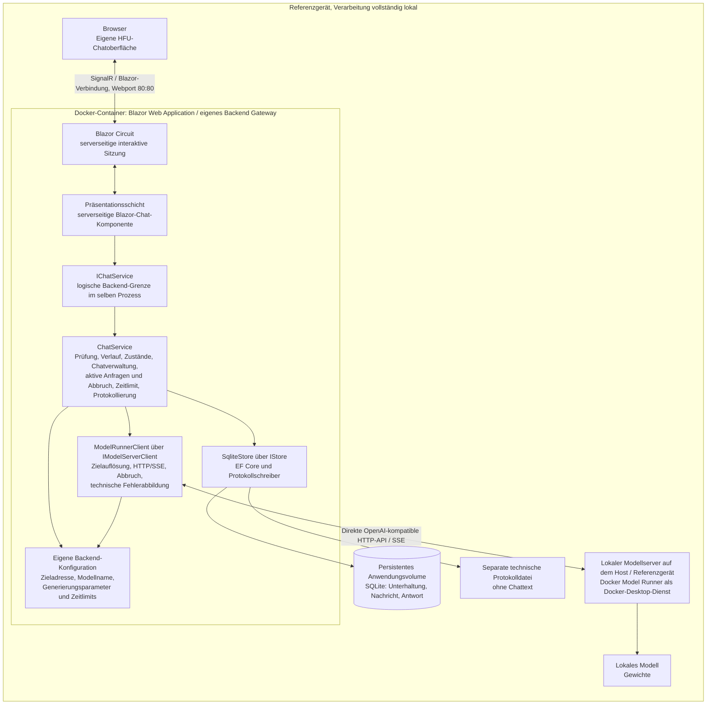
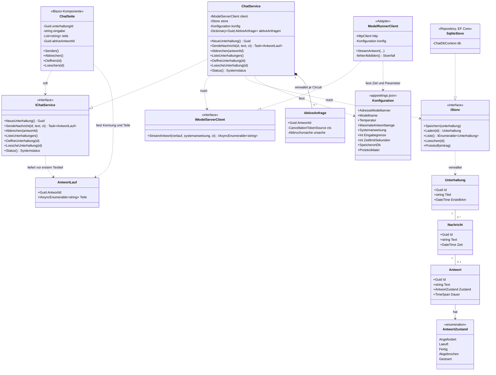
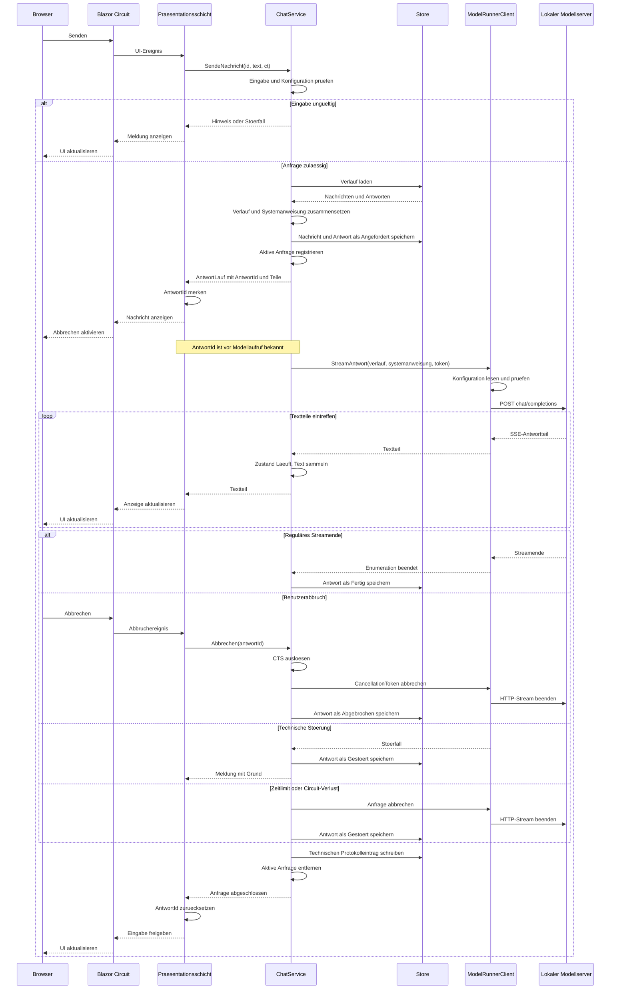
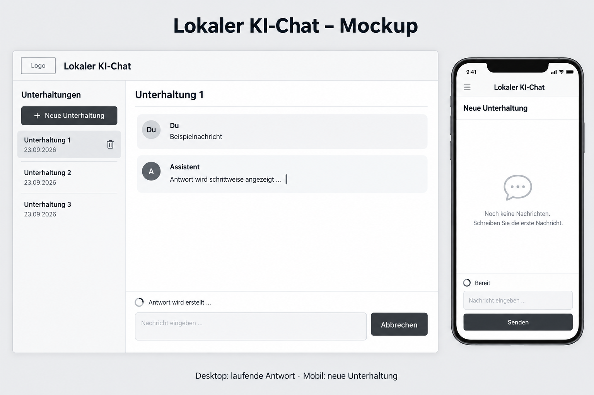
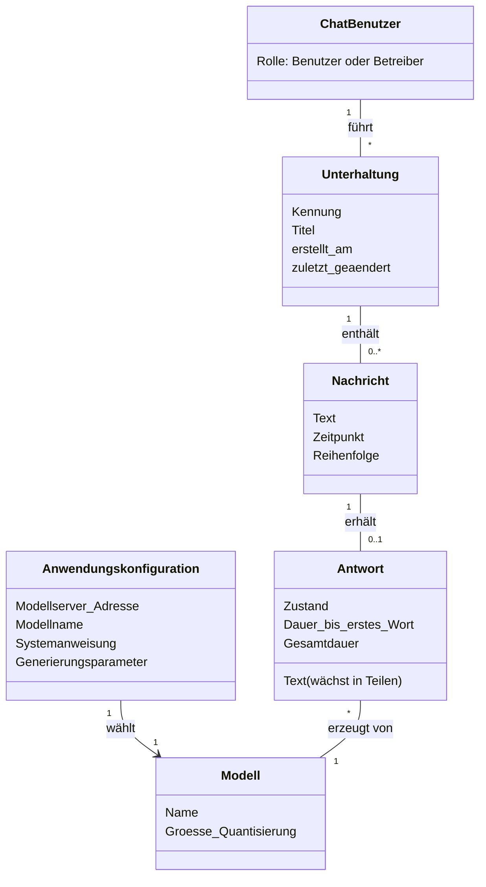

# Wie es gebaut wird: Architektur, Oberflaeche, Daten

> Zielbild vom 23.09.2026 für Entwickler und KI-Werkzeuge, überarbeitet gemäss dem Auftrag zur Entfernung von LiteLLM auf Grundlage von `agent/Use_Cases.md` und der neuen Architekturskizze. Sämtliche bisher im Design dem separaten Gateway zugeordneten Aufgaben übernimmt das selbst entwickelte Backend. Dieses Dokument ist kein unveränderter Konzeptauszug mehr. Das Konzept `20260921-010-RL-Konzept.docx` bleibt der Master; der Abgleich und die Übernahme der Architekturänderung durch die Gruppe in Kapitel 7 und 14.3 stehen noch aus. Die zugehörigen Repository-Unterlagen und die Betriebskonfiguration sind auf dieses Zielbild abgeglichen; offene Entscheide stehen am Ende.

# Architektur

Wie das System gebaut ist: Schichten und Komponenten, der Datenfluss vom Browser bis zum Modell, die Schnittstellen und das Konfigurationskonzept. Das Kapitel ist das Design zum Haupt-Use-Case F01 aus 4.7 und der Nachweis für M03; es muss stehen, bevor die Pakete AP07 und AP08 gebaut werden.

## Komponenten

Die drei logisch getrennten Verantwortungsbereiche aus M03 bleiben erkennbar: Chatfrontend, eigenes Backend und lokaler Modellserver. Die Bezeichnung «Backend Gateway» in der Architekturskizze bezeichnet die Aufgaben des eigenen Backends innerhalb der Blazor-Anwendung. LiteLLM entfällt vollständig als Systembestandteil: Es gibt keinen separaten Gateway-Prozess, keine Gateway-Verwaltungsoberfläche und keine Gatewaydatenbank. Docker Model Runner stellt den lokalen Modellserver bereit.

Die Anwendung enthält Präsentation, Anwendungslogik, einen neutralen LLM-Client und Datenhaltung. Diese Backend-Bausteine sind selbst entwickelt. Die Chat-Seite verwendet Blazor Interactive Server: Ihre Komponentenlogik läuft zusammen mit dem ChatService im Anwendungsprozess; der Browser empfängt die Anzeige über die Blazor-Verbindung. Die Seite kennt ausschliesslich IChatService. Der ChatService nutzt IModelServerClient und IStore unabhängig voneinander. Der Client kapselt den direkten Zugriff auf den Modellserver und greift nie auf den Store zu. Modellkonfiguration, Routing, Generierungsparameter, Streaming, Abbruch und technische Fehlerbehandlung liegen vollständig im eigenen Backend.

Die Aufrufkette lautet: **Browser → Blazor Circuit → serverseitige Präsentationsschicht → IChatService → ChatService**. Der Circuit verwaltet die interaktive Sitzung auf dem Server; Browserereignisse und Anzeigeänderungen werden über die SignalR-Verbindung übertragen. IChatService ist die logische Backend-Grenze innerhalb des Anwendungsprozesses. Der Browser ruft diese C#-Schnittstelle nicht selbst auf. M03 verlangt die Trennung der Verantwortungsbereiche, M05 den Zugriff der Präsentationsschicht ausschliesslich über den Backend-Vertrag; dafür sind keine getrennten Frontend- und Backend-Prozesse erforderlich. Technische Grundlage: [Microsoft: Blazor-Hostingmodelle und Circuits](https://learn.microsoft.com/en-us/aspnet/core/blazor/hosting-models).

Auf dem Referenzgerät läuft ein Anwendungscontainer mit Blazor-Frontend und eigenem Backend. SQLite wird im Anwendungsprozess genutzt; die Datei liegt im persistenten Volume und benötigt keinen eigenen Server. Die Weboberfläche ist gemäss Skizze über die Portzuordnung Host 80 zu Container 80 erreichbar. Die korrekte Bezeichnung für die Modellkomponente lautet **«Lokaler Modellserver auf dem Host / Referenzgerät»**: Docker Model Runner wird als Dienst von Docker Desktop ausserhalb des Anwendungscontainers bereitgestellt. Die pauschale Bezeichnung «Beides Bare Metal» aus der gelieferten Skizze wird damit ersetzt; sie beschreibt die Betriebsweise von Docker Model Runner nicht zutreffend. Ein zweiter Anwendungscontainer für den Modellserver ist nicht vorgesehen. Der Adapter nutzt dessen vom Container aus erreichbare lokale API-Adresse; die Loopback-Adresse im Container bezeichnet nicht den Host. Nur die Weboberfläche wird für den lokalen Browser veröffentlicht; die Modellanbindung bleibt auf dem Referenzgerät. Siehe [Docker Model Runner: Betriebsweise](https://docs.docker.com/ai/model-runner/).

Diagramm: Komponenten, Prozessgrenzen und Aufrufwege des Zielbilds. Ersetzt hier die Darstellung zu `047_schichtenmodell.png`; das Bild im Konzept ist noch abzugleichen.

| Komponente                             | Schicht                     | Verantwortung                                                                                                                                                                                                                                               | Schnittstelle                                                         | Technik im Zielbild                                                              |
| -------------------------------------- | --------------------------- | ----------------------------------------------------------------------------------------------------------------------------------------------------------------------------------------------------------------------------------------------------------- | --------------------------------------------------------------------- | -------------------------------------------------------------------------------- |
| Chat-Seite                             | Präsentation                | F01 bis F06 bedienen: Eingabe, Streaming anzeigen, Abbruch für die aktive Antwort-ID anfordern, Unterhaltungen anlegen, auswählen und löschen, Meldungen; HFU-Design                                                                                        | serverseitige Komponente ruft nur IChatService                        | eigene Blazor-Komponente (Interactive Server), CSS, optional Bootstrap           |
| ChatService                            | Anwendung                   | Eingabe prüfen, Verlauf und Systemanweisung zusammensetzen, aktive Anfragen über Antwort-ID verwalten, Abbruch auslösen, Client aufrufen, Teile weiterreichen, Antwortzustände setzen, Chatverwaltung und Speicherung steuern, Anfrageprotokoll veranlassen | IChatService; nutzt IModelServerClient und IStore                     | C#, Dependency Injection, Lebensdauer je Blazor Circuit                          |
| Anwendungskonfiguration                | Anwendung / Anbindung       | Lokale Zieladresse, Modellname und Generierungsparameter bereitstellen; Zeitlimits, Systemanweisung, Eingabegrenze und Speicherpfade verwalten und validieren                                                                                               | ChatService und Client lesen die für die Anfrage gültigen Werte       | appsettings.json und Umgebungsvariablen                                          |
| IModelServerClient / ModelRunnerClient | Anbindung                   | Ziel aus eigener Konfiguration auflösen, Anfrage mit Modellname und Parametern direkt senden, SSE lesen, Abbruch weitergeben, technische Zeitlimits und Transport-/Modellserverfehler in Störfälle übersetzen                                               | produktneutrale Schnittstelle; OpenAI-kompatible Chat-Completions-API | eigener C#-Adapter mit HttpClient und CancellationToken                          |
| IStore / SqliteStore                   | Datenhaltung                | Unterhaltung, Nachricht und Antwort speichern, laden und löschen; technische Einträge in separate Datei schreiben                                                                                                                                           | IStore, ausschliesslich vom ChatService genutzt                       | Entity Framework Core, SQLite und Protokolldatei im persistenten Volume          |
| Modellserver                           | mitgelieferte Infrastruktur | Modell laden, Text erzeugen und streamen                                                                                                                                                                                                                    | OpenAI-kompatible HTTP-API direkt zum eigenen Adapter                 | Docker Model Runner als lokaler Dienst auf dem Referenzgerät                     |
| Modell                                 | mitgeliefert                | lokale Modellgewichte                                                                                                                                                                                                                                       | vom Modellserver geladen                                              | Modellwahl gemäss Konzept 6.8; Bereitstellung passend zum gewählten Modellserver |

Tabelle : Komponenten und Schichten

F07 (Konfiguration ändern) und F08 (technisches Protokoll einsehen) sind Betreiberfunktionen. Dafür sind die eigene Backend-Konfiguration und die technische Protokolldatei vorgesehen; eine Administrationsoberfläche ist nicht erforderlich. Eine Modellauswahl durch Chat-Benutzer bleibt K01, eine eigene Administrationsansicht K07. Eigene Benutzerverwaltung, Vektordatenbank, externe KI-Dienste und Betrieb über das Internet gehören nicht zum Mussumfang.

### Übernahme der bisherigen Gateway-Aufgaben

Die folgende Zuordnung deckt alle im bisherigen Design LiteLLM zugewiesenen Aufgaben ab. Sie verteilt sie auf die bestehenden Bausteine des eigenen Backends, ohne einen weiteren Dienst einzuführen.

| Bisherige Aufgabe                             | Umsetzung im eigenen Backend                                                                                                                                                                            |
| --------------------------------------------- | ------------------------------------------------------------------------------------------------------------------------------------------------------------------------------------------------------- |
| Modellserver kapseln                          | ModelRunnerClient hinter IModelServerClient spricht direkt mit dem lokalen Modellserver; UI und ChatService bleiben unabhängig von dessen HTTP-Protokoll                                                |
| Modellwechsel                                 | Die Backend-Konfiguration enthält genau ein lokales Ziel mit Adresse und tatsächlichem Modellnamen. Der Betreiber kann Adresse und Modell ohne Neubau wechseln (F07, Z02)                               |
| Modellkonfiguration und Generierungsparameter | Das Backend validiert Modellziel, Temperatur und maximale Antwortlänge; der Client setzt die Werte in der Modellanfrage                                                                                 |
| Streaming vermitteln                          | Der Client liest und prüft SSE direkt vom Modellserver; der ChatService reicht Textteile an die Blazor-Seite weiter                                                                                     |
| Abbruch weitergeben                           | ChatService ordnet die Antwort-ID der aktiven Anfrage zu und löst deren CancellationTokenSource aus; der Client reicht den Token bis zur HTTP-Anfrage durch. Die Erzeugung muss beim Modellserver enden |
| Technische Zeitlimits und Fehlerbehandlung    | Client: Verbindungszeitlimit, HTTP-/SSE-Fehler und bereinigte Störfälle. ChatService: Gesamtzeitlimit, Antwortzustand, Speicherung und Meldung                                                          |
| Wiederholungen und Modell-Fallbacks steuern   | Im eigenen Backend deaktiviert; kein automatischer Neuversuch und kein unbemerkter Modellwechsel innerhalb einer Anfrage                                                                                |
| Administration und Diagnose                   | Betreiber ändert eigene Konfigurationsdateien oder Umgebungsvariablen (F07) und liest das eigene technische Anfrageprotokoll (F08); Status() liefert den Zustand der direkten Modellanbindung           |

Chatverwaltung, Nachrichtenverwaltung, Verlauf mit Systemanweisung und SQLite-Persistenz bleiben Aufgaben von ChatService und Store. Modellgewichte laden und Text erzeugen bleiben Aufgaben des lokalen Modellservers.

Klassen: Das Klassendiagramm zeigt die Bausteine der eigenen Anwendung. Die Seite kennt IChatService, der ChatService kennt IModelServerClient und IStore; die Umsetzungen werden per Dependency Injection zugewiesen. Der Client übernimmt die technische Modellanbindung im selben Prozess. Unterhaltung, Nachricht und Antwort werden zu Tabellen. Antwortzustände und Übergänge verwaltet ausschliesslich der ChatService. Die Methodennamen folgen hier der Konzeptnotation; im Code tragen asynchrone Methoden das Suffix Async.

Diagramm: Design-Klassendiagramm F01 im Zielbild: Bausteine, Fachklassen und Zustand. Die Darstellung zu `051_klassendiagramm_f01.png` im Konzept ist noch abzugleichen.

Muster: Der Adapter ModelRunnerClient kapselt das gemeinsame OpenAI-kompatible Protokoll und verwendet das konfigurierte Modellziel. Modellserver-Adresse, Modellkennung und Generierungsparameter kommen vollständig aus der eigenen Backend-Konfiguration. Ein Austausch erfordert bei Einhaltung des unten beschriebenen Vertrags keine Änderung am Anwendungscode (Z02). Repository trennt die Datenhaltung hinter IStore ab. Die Zustandsmaschine mit fünf Antwortzuständen liegt im ChatService; Zustand und Text werden gespeichert. Dependency Injection erlaubt in Tests einen Fake-Client und einen Store im Arbeitsspeicher.

AktiveAnfrage ist ein flüchtiger Eintrag im ChatService, keine zusätzliche Tabelle. Der Service besitzt die CancellationTokenSource und merkt sich die Abbruchursache. AntwortLauf übergibt der Präsentationsschicht nur die Antwort-ID und den Textstream, keine CancellationTokenSource. Der Benutzerabbruch erfolgt ausschliesslich über Abbrechen(antwortId).

## Datenfluss Browser bis Modell

Der Datenfluss löst F01 aus `agent/Use_Cases.md` in die Bausteine des Zielbilds auf. Der ChatService prüft zuerst die Eingabe. Leerer Text wird mit einem Hinweis abgewiesen, zu langer Text mit Angabe der Grenze; es erfolgt kein Aufruf des Clients. Bei gültiger Eingabe lädt der Service den bisherigen Verlauf und nimmt die neue Nachricht genau einmal auf. Die Systemanweisung wird als eigener Parameter an den Client übergeben und von diesem genau einmal vor dem Verlauf serialisiert; sie ist nicht zusätzlich im Verlaufsparameter enthalten. Systemanweisung, Benutzertexte und bisherige Antworten bleiben dabei nach Rollen getrennt.

Diagramm: Designmodell F01 im Zielbild mit Streaming, Abbruch und Störungen. Die Darstellung zu `048_design_sequenz_f01.png` im Konzept ist noch abzugleichen.

Die Alternativen im Diagramm sind mögliche Ausgänge derselben Anfrage. Der Benutzerabbruch kann ab Rückgabe der Antwort-ID, insbesondere vor dem Modellaufruf, beim Verbindungsaufbau und zwischen beliebigen Textteilen eintreten. Störungen können ebenfalls vor oder während der Ausgabe auftreten. Die Darstellung nach der Schleife ordnet die möglichen Abschlüsse und bedeutet nicht, dass Abbrechen erst nach der Ausgabe verarbeitet wird. Nach einem Endzustand werden keine weiteren Teile übernommen. Der ChatService speichert genau einen Endzustand und veranlasst einen technischen Abschlusseintrag.

Streaming-Technik: SendeNachrichtAsync liefert nach Prüfung, Speicherung und Registrierung ein AntwortLauf-Objekt zurück. Die serverseitige Komponente merkt sich dessen AntwortId und beginnt unmittelbar danach die einmalige asynchrone Enumeration von Teile. Erst diese Enumeration startet den Modellaufruf. Der Client liest SSE direkt vom Modellserver und liefert Textteile als `IAsyncEnumerable<string>`. Der Service reicht sie über AntwortLauf.Teile an die Komponente weiter; diese aktualisiert die Anzeige mit StateHasChanged über den Circuit und die SignalR-Verbindung. Die Enumeration darf den Circuit nicht synchron blockieren, damit Abbruchereignisse während des Wartens auf Modellantworten verarbeitet werden. Zwischen Präsentationsschicht und Service ist kein eigener Chat-HTTP-Endpunkt nötig. SSE wird zwischen eigenem Client und Modellserver verwendet, nicht als zusätzlicher Browserkanal. Streaming ist für Z03 verpflichtend; eine vollständige Antwort erst am Ende anzuzeigen erfüllt die Anforderung nicht.

Abbruch: Die Präsentationsschicht ruft ausschliesslich Abbrechen(antwortId) auf. Der ChatService sucht die Antwort-ID in seinen aktiven Anfragen, merkt die Ursache Benutzerabbruch vor und löst seine eigene CancellationTokenSource aus. Der daraus abgeleitete Token wird bis zum Client durchgereicht; dieser beendet HTTP-Anfrage und Stream direkt zum Modellserver. Ein Abbruch vor Beginn der Enumeration verhindert bereits den Modellaufruf; der Service schliesst diese vorbereitete Antwort auch ohne gestartete Enumeration als Abgebrochen ab und entfernt den aktiven Eintrag. Wiederholte Abbruchaufrufe und Aufrufe für bereits abgeschlossene Antworten ändern keinen Endzustand und starten keine neue Anfrage. Die Zuordnung ist auf den jeweiligen Circuit begrenzt; eine unbekannte Antwort-ID kann keine fremde Anfrage abbrechen.

Der ct-Parameter von SendeNachrichtAsync dient ausschliesslich dem technischen Lebenszyklus, etwa dem endgültigen Ende des Circuits. Er ist kein zweiter Mechanismus für den Abbrechen-Knopf. Der ChatService verbindet Lebenszyklus und Zeitlimit mit seinem internen Anfrage-Token, hält die Ursachen unterscheidbar und beendet auch vorbereitete, noch nicht enumerierte Anfragen beim Ende ihres Lebenszyklus. Die Seite hält keine CancellationTokenSource für den Benutzerabbruch. Bei Erfolg, Abbruch oder Störung entfernt der Service den aktiven Eintrag und gibt dessen Ressourcen frei; die Seite setzt ihre aktive Antwort-ID zurück. Wenn Abschluss und Abbruch zusammentreffen, wird nur der zuerst festgelegte Endzustand gespeichert.

Das Schliessen des lokalen Streams allein beweist noch keinen Stopp der Modellerzeugung. Die tatsächliche Beendigung auf Docker Model Runner ist deshalb vor dem Einsatz durch einen Integrationstest nachzuweisen. Teilantwort und Zustand Abgebrochen werden auch bei noch leerem Text gespeichert. Die abschliessende Speicherung darf nicht durch den bereits ausgelösten Anfrage-Token verhindert werden.

Zeitlimit und Verbindung: Das Gesamtzeitlimit verantwortet der ChatService, das technische Verbindungszeitlimit der eigene Client. Beide Grenzen kommen aus der Backend-Konfiguration; das Gesamtzeitlimit umfasst auch das Lesen des Streams. Die Abbruchursache bleibt unterscheidbar: Benutzerabbruch ergibt Abgebrochen, Zeitüberschreitung ergibt Gestoert. Ein Stream ohne regulären Abschluss ergibt ebenfalls Gestoert; bereits gelieferte Teile bleiben erhalten. Bei endgültigem Verlust der Blazor-Verbindung wird die Anfrage beendet und als Gestoert mit Grund Verbindungsverlust gespeichert; nach erneutem Öffnen ist der Zustand sichtbar. Automatische Wiederholungen und Modell-Fallbacks sind im eigenen Backend deaktiviert, damit eine Anfrage nicht unbemerkt doppelt ausgeführt wird.

Bedienung und Zustände: Nach Erfolg, Abbruch oder behandelter Störung ist die Eingabe wieder frei. Bei Nichterreichbarkeit bleibt der gesendete Text gemäss F01-Erweiterung 3a im Eingabefeld erhalten. Neben den bisherigen Übergängen muss F02 auch Abbruch vor dem ersten Teil erlauben: Angefordert → Abgebrochen. Dieser in der bisherigen Zustandszeichnung fehlende Übergang ist im Masterkonzept nachzuführen; er ist hier ausdrücklich beschrieben und nicht als bereits abgeglichen behauptet.

## Schnittstellen

Präsentationsschicht zu Backend: Die serverseitige Blazor-Chat-Komponente ruft ausschliesslich IChatService auf. Diese C#-Schnittstelle bildet die dokumentierte logische Backend-Grenze (M05) im gemeinsamen Prozess. Der Browser erreicht die Komponente über den Circuit und SignalR und hat keinen direkten Zugriff auf IChatService.

| Methode                                  | Funktion | Eingabe                                       | Ausgabe                                                                                                                                            |
| ---------------------------------------- | -------- | --------------------------------------------- | -------------------------------------------------------------------------------------------------------------------------------------------------- |
| NeueUnterhaltung()                       | F03      | keine                                         | Kennung der Unterhaltung                                                                                                                           |
| SendeNachricht(unterhaltungId, text, ct) | F01      | Kennung, Text, technischer Lebenszyklus-Token | `Task<AntwortLauf>`: AntwortId und Teile als `IAsyncEnumerable<string>`; ID vor Modellaufruf verfügbar, Endzustand über OeffneUnterhaltung lesbar  |
| Abbrechen(antwortId)                     | F02      | Kennung der aktiven Antwort                   | ChatService löst den internen Anfrage-Token aus; nach Beendigung und Speicherung Zustand Abgebrochen, sofern nicht bereits ein Endzustand vorliegt |
| ListeUnterhaltungen()                    | F04      | keine                                         | Kennungen, Titel, Datum                                                                                                                            |
| OeffneUnterhaltung(id)                   | F04      | Kennung                                       | Nachrichten und Antworten in Reihenfolge                                                                                                           |
| LoescheUnterhaltung(id)                  | F05      | Kennung                                       | Bestätigung                                                                                                                                        |
| Status()                                 | F06, K07 | keine                                         | Zustand der direkten Modellanbindung, konfigurierter Modellname, Gültigkeit der Backend-Konfiguration                                              |

Tabelle : Schnittstelle IChatService

Die Operationen von IChatService bleiben fachlich erhalten; der Rückgabevertrag von SendeNachrichtAsync wird auf `Task<AntwortLauf>` geändert. Ein reiner Textstream liefert keine Antwort-ID vor dem ersten Teil und reicht für den ID-basierten Abbruch nicht aus. AntwortLauf enthält `Guid AntwortId` und `IAsyncEnumerable<string> Teile`. Die Kennung wird vom Service erzeugt und mit der Antwort im Zustand Angefordert gespeichert, bevor sie an die Komponente zurückgeht. Dafür ist kein Polling des Stores erforderlich. `agent/Schnittstellen.md` enthält diesen Vertrag bereits; die Übernahme in Konzept 7.3 und die Freigabe durch die Gruppe stehen noch aus. IStore und der Textstream des IModelServerClient bleiben unverändert.

Abbrechen bezeichnet die fachliche Operation im ChatService, keinen zusätzlichen produktspezifischen HTTP-Endpunkt. Ein ct-Parameter von AbbrechenAsync betrifft nur den Methodenaufruf, nicht die Auswahl des abzubrechenden Requests. Status() beschreibt die direkte Modellanbindung; eine laufende Blazor-Anwendung allein beweist keine Erreichbarkeit oder erfolgreiche Modellerzeugung. Netzwerkzugriffe für die Statusermittlung erfolgen ebenfalls nur über den Adapter. Ein eigener HTTP-Endpunkt `GET /status` ist nicht Teil von AP07 und für den Chat nicht erforderlich.

### Backend zu lokalem Modellserver

IModelServerClient bleibt die produktneutrale Schnittstelle mit `StreamAntwortAsync(verlauf, systemanweisung, ct)` und `IAsyncEnumerable<string>` als Ausgabe. Die Umsetzung heisst ModelRunnerClient. UI und Fachlogik verwenden keine produktspezifischen SDKs oder Modellserverdetails. Der Client liest Zieladresse und Modellkennung aus der Backend-Konfiguration und sendet die tatsächliche Modellkennung direkt an den lokalen Modellserver. Er setzt folgenden gemeinsamen HTTP-Vertrag um:

| Bestandteil           | Vertrag                                                                                                                                                                                                                            |
| --------------------- | ---------------------------------------------------------------------------------------------------------------------------------------------------------------------------------------------------------------------------------- |
| Ziel                  | AdresseModellserver des aufgelösten lokalen Ziels einschliesslich API-Präfix; daran relativ `POST chat/completions`                                                                                                                |
| Anfrage               | JSON mit `model` als tatsächlichem Modellnamen des Ziels, `messages` mit den Rollen system, user und assistant sowie `stream=true`                                                                                                 |
| Verlauf               | Systemanweisung genau einmal als system-Nachricht serialisieren, danach den vom ChatService aufgebauten Verlauf einschliesslich der neuen Nachricht senden; Client und Modellserver speichern keinen Chatverlauf für die Anwendung |
| Generierungsparameter | Temperatur als `temperature`, maximale Antwortlänge in Tokens als `max_tokens`; beide Werte aus der eigenen Backend-Konfiguration                                                                                                  |
| Antwort               | SSE-Ereignisse im OpenAI-kompatiblen Chat-Completions-Format; Text aus `choices[].delta.content`, Abschlussinformation und reguläres Streamende (`[DONE]`) auswerten                                                               |
| Auswertung            | Ereignisse ohne Text, etwa Rollen- oder Nutzungsinformationen, erzeugen keinen sichtbaren Text; ein Verbindungsende ohne regulären Abschluss ist ein Störfall                                                                      |
| Authentifizierung     | Falls der gewählte lokale Modellserver dies erfordert, Standardheader `Authorization: Bearer ...` aus serverseitiger Konfiguration; keine Modellzugangsdaten im Browser                                                            |
| Abbruch               | CancellationToken bis zur direkten HTTP-Anfrage weitergeben und Stream schliessen; Stopp der Modellerzeugung im Integrationstest nachweisen                                                                                        |

API-Basisadresse, Modellkennung und Parameter liegen ausschliesslich in der eigenen Backend-Konfiguration. Das OpenAI-kompatible Format beschreibt ein Protokoll und bedeutet keinen Aufruf des externen OpenAI-Dienstes. API-Präfix und Modellname werden konfiguriert. Die Eignung einschliesslich Abbruch und Fehlerverhalten ist für Docker Model Runner nachzuweisen. Quelle: [Docker Model Runner: API](https://docs.docker.com/ai/model-runner/api-reference/).

### Technische Fehler und fachliche Störfälle

Das eigene Backend übernimmt die gesamte technische Fehlerbehandlung: Die Konfigurationsprüfung erkennt ungültige Werte und Zuordnungen; der Client erkennt Verbindungs-, HTTP- und Streamingfehler direkt vom Modellserver und übersetzt sie in die bestehende `StoerfallException`. Der ChatService entscheidet über Zustand, Speicherung und verständliche Meldung. Es werden keine neuen Störfallkategorien benötigt:

| Bestehender Störfall        | Zuordnung im Zielbild                                                                                                            |
| --------------------------- | -------------------------------------------------------------------------------------------------------------------------------- |
| ModellserverNichtErreichbar | Lokaler Modellserver nicht erreichbar oder Verbindung/Stream unerwartet unterbrochen; der Client liefert einen bereinigten Grund |
| ModellUnbekannt             | Der Modellserver meldet, dass die konfigurierte tatsächliche Modellkennung unbekannt ist                                         |
| KonfigurationUngueltig      | Ungültige Backend-Konfiguration, fehlende Adresse oder Modellname, falsche API-Basisadresse oder ungültige Parameter             |
| Zeitueberschreitung         | Technisches Zeitlimit oder Gesamtzeitlimit der Anfrage erreicht                                                                  |

HTTP-Status allein identifiziert nicht immer den fachlichen Grund: Ein 404 kann beispielsweise eine falsche Route oder ein unbekanntes Modell betreffen. Der Client wertet Status und verfügbare Fehlerinformationen aus; etwaige Unterschiede zwischen Modellservern bleiben im Adapter gekapselt und werden geprüft. Ein nicht eindeutig zuordenbarer technischer Ausfall wird als ModellserverNichtErreichbar mit einem neutralen Grund zur fehlgeschlagenen Modellanbindung behandelt. Benutzerabbruch ist kein Störfall. Rohe Fehlerantworten, Stacktraces, Zugangsdaten und möglicherweise darin enthaltene Chattexte werden weder an die UI noch in technische Protokolle übernommen. Bei Konfigurationsfehlern wird der betroffene Wertname genannt, nicht ein geheimes oder vertrauliches Wertfragment.

## Konfigurationskonzept

| Wert                                 | Verantwortung / Ablage                                                          | Wirkung                                                                                                                               |
| ------------------------------------ | ------------------------------------------------------------------------------- | ------------------------------------------------------------------------------------------------------------------------------------- |
| AdresseModellserver                  | Backend: appsettings.json, Abschnitt Chat; überschreibbar per Umgebungsvariable | Vom Anwendungscontainer erreichbare lokale API-Basisadresse einschliesslich API-Präfix                                                |
| Modellname                           | Backend: dito                                                                   | Tatsächliche Modellkennung für das Anfragefeld model                                                                                  |
| Temperatur und MaximaleAntwortlaenge | Backend: dito                                                                   | Generierungsparameter für den Client; Antwortlänge in Tokens, Werte innerhalb der vom eingesetzten Modellserver unterstützten Grenzen |
| Systemanweisung                      | Backend: appsettings.json oder Umgebungsvariable                                | Vom ChatService jeder Anfrage genau einmal zugeordnet und vom Client als system-Nachricht serialisiert                                |
| Eingabegrenze                        | Backend: dito                                                                   | Prüfung vor dem Client-Aufruf; bisheriger Vorschlag 4000 Zeichen bleibt ein offener Konzeptentscheid                                  |
| ZeitlimitSekunden                    | Backend: dito                                                                   | Gesamtzeitlimit im ChatService; bisheriger Konzeptwert 60 Sekunden                                                                    |
| SpeicherortDb und Protokolldatei     | Backend: dito                                                                   | SQLite und separate technische Protokolldatei im persistenten Anwendungsvolume                                                        |

Tabelle : Konfigurationswerte

Alle Einstellungen liegen ausserhalb des Sourcecodes unter `Chat` in appsettings.json und in Umgebungsvariablen; Umgebungsvariablen überschreiben die entsprechenden Werte aus der Datei. Die Struktur entspricht `agent/Schnittstellen.md` und `src/LocalAiFront/appsettings.example.json`. Keine Geheimnisse und keine persönlichen Pfade im Code oder in eingecheckten Konfigurationen; die Beispielkonfiguration enthält nur Platzhalter.

Das Backend prüft vor einer Modellanfrage, ob Adresse und Modellname vorhanden sind und Parameter sowie Zeitlimit gültig sind. Das zulässige Modellziel befindet sich ausschliesslich auf dem Referenzgerät. Eine ungültige Chatkonfiguration verhindert Modellanfragen und wird mit dem betroffenen Wertnamen verständlich gemeldet (F06, F07). Ein syntaktisch gültiger, aber beim Server unbekannter Modellname wird bei der Modellanbindung als ModellUnbekannt gemeldet. Die Seite enthält keine Eingabemöglichkeit für beliebige Modellserver-Adressen.

Der Client verwendet Adresse, Modellname und Parameter für die gesamte Anfrage unverändert. ChatService und Client lesen denselben Konfigurationsstand; eine laufende Antwort wird nicht auf ein anderes Ziel umgeleitet. Es gibt keine Lastverteilung, automatische Wiederholung oder Ersatzmodelle. Mehrere auswählbare Modelle im laufenden Chat gehören weiterhin zu K01 und erweitern nicht den Mussumfang.

### Austausch ohne Codeänderung

- Modellserver wechseln: In der eigenen Backend-Konfiguration die Zieladresse einschliesslich API-Präfix anpassen. Die Anwendung wird nicht neu gebaut.
- Modell wechseln: Den Modellnamen ändern; vorab muss das Modell lokal bereitgestellt sein. Systemanweisung und Laufzeitparameter sind ebenfalls ohne Codeänderung konfigurierbar (F07, Z02).
- Konfigurationsänderungen dürfen einen Neustart der Anwendung erfordern. Austauschbarkeit bedeutet Konfiguration ohne Codeänderung, nicht zwingend einen unterbrechungsfreien Wechsel. Eine beliebige nur teilweise OpenAI-kompatible Implementierung ist nicht automatisch geeignet; der gemeinsame HTTP-, Streaming-, Fehler- und Abbruchvertrag muss nachgewiesen sein.

Offlinebetrieb (Z01): Anwendung mit eigenem Backend, SQLite, Modellserver und Modell bleiben auf dem Referenzgerät. Images, Modelle und sonstige Laufzeitressourcen müssen vor dem Offlinebetrieb lokal vorhanden sein. Es werden keine externen KI-Dienste, Telemetrie, externen Logging-Callbacks oder Cloud-Fallbacks verwendet. Der Browser lädt auch die Ressourcen der Chatoberfläche lokal.

# UI-Konzept

Wie die Chatoberfläche aussieht und bedient wird: das Mockup mit den sieben Bedienabläufen von S. 12 der Kursunterlagen und die Umsetzung des Corporate Designs der HFU (M07).

Die Chat-UI wird vollständig selbst entwickelt und verwendet ausschliesslich IChatService. Der Betreiber ändert für F07 die eigene Backend-Konfiguration und sieht für F08 die technische Protokolldatei ein. Daraus entsteht keine zusätzliche Pflichtansicht im Chat; eine eigene Administrationsansicht bleibt K07.

## Mockup

Das Mockup zeigt eine Seite mit drei Bereichen: links die Liste der Unterhaltungen mit Titel und Datum (F03, F04, F05), in der Mitte der Verlauf mit Nachrichten und Antworten, unten das Eingabefeld mit einem Knopf, der je nach Zustand Senden oder Abbrechen heisst (F01, F02). Eine Statuszeile über dem Eingabefeld zeigt Meldungen mit Grund (F06). Die sieben Bedienabläufe von S. 12 sind damit je einem Element zugeordnet. Zwei Fensterbreiten: die Liste klappt auf schmalen Bildschirmen ein.

Abbildung: Desktop während einer laufenden Antwort und Mobilansicht einer neuen Unterhaltung. KI-generierter Gestaltungsentwurf mit neutralen Farben und Logo-Platzhalter; das freigegebene HFU Corporate Design ist noch anzuwenden. Die Texte sind illustrative Platzhalter. Erstellt mit dem integrierten Imagegen-Werkzeug; [verwendeter Prompt](bilder/20260923-001-KI-Chat-Mockup-Prompt.txt).

## Corporate-Design

Logo, Farben und Schrift kommen aus den bereitgestellten Gestaltungselementen (\_Logos; Frage A1 klärt den Umfang). Farben und Schrift liegen als CSS-Variablen an einer Stelle, das Logo steht im Seitenkopf. Die Prüfung ist ein Testfall in 11.3 (M07).

# Datenhaltung

Welche Daten wo gespeichert werden, wie eine Unterhaltung eindeutig ist, was bei Löschung und Neustart geschieht und warum technische Protokolle vom Chattext getrennt bleiben (S. 9). Grundlage ist das konzeptionelle Modell aus der Analyse; daraus werden die Tabellen.

## Welche Daten, wo

Gespeichert werden Unterhaltung (Kennung, Titel, Erstellt am), Nachricht (Kennung, Unterhaltung, Text, Zeit) und Antwort (Kennung, Nachricht, Text, Zustand, Dauer). Nur diese drei Chatentitäten werden zu SQLite-Tabellen; ihre Beziehungen werden durch Fremdschlüssel abgebildet. Chat-Benutzer als Akteur, Konfiguration und Modell beschreiben den fachlichen Kontext und werden nicht zu zusätzlichen Tabellen. SQLite ist die alleinige Quelle für den gespeicherten Chatverlauf. Der ChatService stellt den Verlauf für jede Anfrage zusammen; der Client sendet ihn direkt an den lokalen Modellserver. Chatverwaltung und Chatpersistenz liegen vollständig bei ChatService und Store; ein Antwortcache ist im Zielbild nicht vorgesehen.

Diagramm: Fachlicher Kontext und die drei gespeicherten Chatentitäten. Die Darstellung zu `046_konzeptmodell.png` im Masterkonzept ist abzugleichen; sie ist keine vollständige Tabellenvorgabe.

Speicherort: eine SQLite-Datei über Entity Framework Core (Entscheid 6.4), im persistenten Volume der Anwendung, damit sie den Neustart des Containers überlebt. Der Browser persistiert keinen Chatverlauf. Das folgende Entity-Relationship-Modell zeigt ausschliesslich die drei Chatentitäten und ihre Fremdschlüssel; der Antwortzustand ist ein Enum als Zahl. Die Tabellen entstehen aus den Klassen (Code First); die Migration «Initial» gehört zu AP09. Ein Wechsel des Modellservers oder Modells ändert weder dieses Schema noch die bestehenden Unterhaltungen.

Diagramm: Entity-Relationship-Modell: drei Tabellen, zwei Beziehungen mit Kaskade, Zustand als Enum. Die Darstellung zu `054_erm.png` im Konzept ist insbesondere bei der leeren Unterhaltung abzugleichen.

| Tabelle      | Feld           | Typ in SQLite        | Schlüssel und Regel                                                                     |
| ------------ | -------------- | -------------------- | --------------------------------------------------------------------------------------- |
| Unterhaltung | Id             | TEXT (GUID)          | Primärschlüssel, beim Anlegen erzeugt                                                   |
| Unterhaltung | Titel          | TEXT, nicht null     | vorläufiger Titel bei leerer Unterhaltung, danach Anfang der ersten Nachricht, änderbar |
| Unterhaltung | ErstelltAm     | TEXT (ISO 8601)      | Sortierung der Liste (F04)                                                              |
| Nachricht    | Id             | TEXT (GUID)          | Primärschlüssel                                                                         |
| Nachricht    | UnterhaltungId | TEXT                 | Fremdschlüssel auf Unterhaltung, Index, Löschen kaskadiert                              |
| Nachricht    | Text           | TEXT, nicht null     | höchstens Eingabegrenze (7.4)                                                           |
| Nachricht    | Zeit           | TEXT (ISO 8601)      | Reihenfolge im Verlauf                                                                  |
| Antwort      | Id             | TEXT (GUID)          | Primärschlüssel                                                                         |
| Antwort      | NachrichtId    | TEXT                 | Fremdschlüssel auf Nachricht, eindeutig (eine Antwort je Nachricht), Löschen kaskadiert |
| Antwort      | Text           | TEXT, darf leer sein | wächst mit den Teilen; bei Abbruch bleibt der Teil                                      |
| Antwort      | Zustand        | INTEGER              | Enum AntwortZustand: 0 Angefordert, 1 Läuft, 2 Fertig, 3 Abgebrochen, 4 Gestört (4.7.6) |
| Antwort      | Grund          | TEXT, null           | nur bei Gestört: einer der vier Störfälle mit Text                                      |
| Antwort      | DauerMs        | INTEGER, null        | Gesamtdauer, für die Messung (11.4)                                                     |
| Antwort      | ErstelltAm     | TEXT (ISO 8601)      | Beginn der Anfrage                                                                      |

Tabelle : Tabellen und Felder der SQLite-Datenbank

Nicht in der Chatdatenbank: der technische Protokolleintrag (eigene Datei ohne Chattext) und die Backend-Konfiguration einschliesslich Modellzuordnung. Eine weitere Verwaltungsdatenbank wird nicht benötigt. Beim Neustart wird jede Antwort im Zustand Angefordert oder Läuft auf Gestört mit Grund «Neustart» gesetzt, damit kein Zustand ohne laufende Anfrage existiert. Die Zeit bis zum ersten Textteil wird im technischen Protokoll festgehalten; dafür ist keine weitere Chattabelle erforderlich.

## Kennung, Löschung, Neustart

Kennung: jede Unterhaltung, Nachricht und Antwort erhält beim Anlegen eine GUID. Eine neue Unterhaltung darf null Nachrichten enthalten (F03) und erhält zunächst einen vorläufigen Titel; nach der ersten Nachricht wird deren Anfang als Titel verwendet. Der Titel kann geändert werden. Löschung: F05 entfernt die Unterhaltung mit allen Nachrichten und Antworten (Kaskade); der technische Protokolleintrag bleibt, weil er keinen Chattext enthält. Neustart: die SQLite-Datei bleibt im Volume, die Liste wird beim Start geladen; eine Antwort, die beim Neustart noch lief, wird als Gestört mit Grund Neustart gespeichert. Öffnen, Löschen und Wiederherstellen der Unterhaltungen erfolgen ausschliesslich über ChatService und Store und benötigen keinen erreichbaren Modellserver.

## Technische Logs getrennt von Chatdaten

Das technische Anfrageprotokoll der Anwendung steht in einer eigenen Datei im Volume, ein Eintrag je Modellanfrage: Zeitpunkt, Art des Vorgangs, Kennung der Unterhaltung, Modellname, Dauer bis zum ersten Textteil, Gesamtdauer, Anzahl Zeichen, Endzustand und bei Störung ein bereinigter Grund. Wenn kein Textteil eintrifft, ist die Dauer bis zum ersten Teil nicht vorhanden. Der ChatService verantwortet diesen Eintrag auch bei Abbruch und Störung. Zweck sind Messung für M11 und Fehlersuche durch den Betreiber (F08).

Kein Chattext, keine Systemanweisung, keine Zugangsdaten und keine rohen Anfrage-, Antwort- oder Fehlerinhalte werden technisch protokolliert. Das gilt für die Anwendung mit eigenem Backend und für den Modellserver einschliesslich ihrer Standardausgabe und Fehlerausgabe. Inhaltslogging, entsprechende Debug-Ausgaben und externe Logging-Callbacks werden deaktiviert; die eingesetzte Konfiguration wird darauf geprüft. Bereinigte technische Modellserverlogs dürfen zusätzlich zur Fehlerdiagnose dienen, sind aber keine Quelle für den Chatverlauf. Auch technische Metadaten werden vor einer Weitergabe geprüft.

# Nachweise und Dokumentabgleich

## Zuordnung zu Funktionen und Zielen

| Funktionen / Ziele  | Verantwortliche Bausteine und Nachweis im Zielbild                                                                                                                                                               |
| ------------------- | ---------------------------------------------------------------------------------------------------------------------------------------------------------------------------------------------------------------- |
| F01, F02 / Z03      | Chat-Seite, ChatService, eigener Client und lokaler Modellserver: schrittweise Ausgabe, direkter Abbruch der Modellanfrage, Teilantwort bleibt, nächste Frage funktioniert                                       |
| F03, F04, F05 / Z05 | ChatService und SQLite-Store: leere Unterhaltung, gespeicherte Verläufe nach Neustart öffnen, vollständig und einzeln löschen                                                                                    |
| F06 / Z06           | Eigenes Backend prüft Konfiguration und behandelt technische Modellfehler; Client übersetzt Transport-/Modellserverfehler; ChatService speichert Zustand und liefert verständliche Meldung, danach Weiterbetrieb |
| F07 / Z02           | Eigene Backend-Konfiguration: Adresse, Modellname, Systemanweisung und Laufzeitparameter ändern ohne Neubau; Modellserver erfüllen denselben Protokollvertrag                                                    |
| F08 / Z07           | Eigenes technisches Anfrageprotokoll für den Betreiber; Prüfung aller beteiligten Logs auf fehlende Chattexte und Systemanweisungen                                                                              |
| F01 bis F08 / Z01   | Gesamte Verarbeitung im Anwendungscontainer und lokalen Modellserver; fünf Anfragen ohne Internet, keine externen Aufrufe                                                                                        |
| NF04, NF05 / Z04    | Selbst entwickelte Blazor-Chat-UI mit HFU-Gestaltung und vollständiger Bedienbarkeit bei Desktop- und Mobilbreite                                                                                                |

## Prüfungen für die spätere Umsetzung

Diese Szenarien beschreiben die Abnahme des Designs; sie wurden durch die Dokumentänderung nicht ausgeführt. Die bestehenden Fälle aus `agent/Testfaelle.md` bleiben Grundlage.

- F01: leere und zu lange Eingabe ohne Client-Aufruf; gültige Eingabe mit Systemanweisung und korrektem Verlauf; Textteile werden vor Abschluss angezeigt, danach Frage und Antwort gespeichert (T02, T03, T09, T10).
- F02: Antwort-ID vor Modellaufruf an die Komponente zurückgeben; Abbruch ausschliesslich über Abbrechen(antwortId) vor Beginn der Enumeration, vor dem ersten Textteil und während der Ausgabe prüfen. Tatsächliches Ende der Modellerzeugung nachweisen; Teiltext beziehungsweise leere Antwort als Abgebrochen speichern und unmittelbar danach eine weitere Frage senden. Doppelte Abbrüche, unbekannte IDs, Abschluss gleichzeitig mit Abbruch und endgültiges Circuit-Ende prüfen; kein doppelter Endzustand, keine aktiven Einträge oder offenen Streams nach Abschluss (T04 und ergänzende Fälle).
- F06: Modellserver aus, unbekanntes Zielmodell, fehlende Adresse oder Modellname, falsche API-Adresse, ungültige Parameter und Gesamtzeitlimit sowie Streamabbruch nach ersten Teilen; jeweils richtiger Störfall, kein fälschlicher Zustand Fertig, erhaltene Teilantwort und Weiterbetrieb (T07, T08, T11, T12 und ergänzende Integrationsfälle). Bei Nichterreichbarkeit bleibt der Eingabetext erhalten.
- Modellzuordnung: Prüfen, dass der eigene Client die konfigurierte Zieladresse und Modellkennung, Temperatur und Antwortbegrenzung überträgt und während einer Anfrage bei diesem Ziel bleibt. Keine automatische Wiederholung und kein Modell-Fallback.
- Austauschbarkeit: Docker Model Runner über die eigene Backend-Konfiguration anbinden; Modellname, Systemanweisung und Parameter ohne Codeänderung oder Neubau ändern. Streaming, Abbruch, Fehlerabbildung und vorhandene Unterhaltungen erneut prüfen. Der Nachweis gilt nur für die tatsächlich geprüfte Version und die geprüften Modelle.
- Persistenz: leere Unterhaltung anlegen, fünf Unterhaltungen speichern, Anwendung neu starten, alle öffnen und eine vollständig löschen; laufende Zustände nach Neustart als Gestört markieren (T01, T05, T06, Z05).
- Offlinebetrieb und Datenschutz: fünf Anfragen ohne Internet; drei Testanfragen anschliessend gegen sämtliche Anwendungs- und Modellserverlogs prüfen. Keine externen Aufrufe, Chattexte, Systemanweisungen oder Zugangsdaten (N01, N05).
- Oberfläche: eigene HFU-Chat-UI bei beiden festgelegten Fensterbreiten prüfen (N03).

## Ausstehender Abgleich ausserhalb dieses Auftrags

Die Repository-Unterlagen und die Betriebskonfiguration sind für AP07 abgeglichen. Folgende Änderungen am Masterkonzept bleiben durch die Gruppe zu übernehmen und freizugeben:

| Dokument / Referenz                                       | Nachzuführender Abgleich                                                                                                                                                                                                                                                                     |
| --------------------------------------------------------- | -------------------------------------------------------------------------------------------------------------------------------------------------------------------------------------------------------------------------------------------------------------------------------------------- |
| Masterkonzept, Kapitel 7 und 14.3, Architekturabbildungen | Entfernung von LiteLLM, eigene Backend-Aufgaben und direkte Modellanbindung übernehmen. Browser, Circuit, Präsentationsschicht und logische Backend-Grenze unterscheiden; ursprüngliche Grafik mit «Lokaler Modellserver auf dem Host / Referenzgerät» statt «Beides Bare Metal» beschriften |
| Masterkonzept 4.7.6 und Zustandsdiagramm                  | Benutzerabbruch bereits aus Angefordert berücksichtigen; `agent/Use_Cases.md` enthält den ergänzten Übergang als Arbeitsgrundlage.                                                                                                                                                           |
| Masterkonzept 7.3                                         | `SendeNachrichtAsync` liefert `Task<AntwortLauf>` mit Antwort-ID vor Modellaufruf und Textstream; `AbbrechenAsync` ordnet ausschliesslich im ChatService die aktive Anfrage zu. IStore und `StreamAntwortAsync` bleiben erhalten.                                                            |

Die Freigabe des Designs und die Übernahme in das Masterkonzept bleiben bei der Gruppe. Erst danach ist AP07 gemäss Definition of Ready freigegeben.
