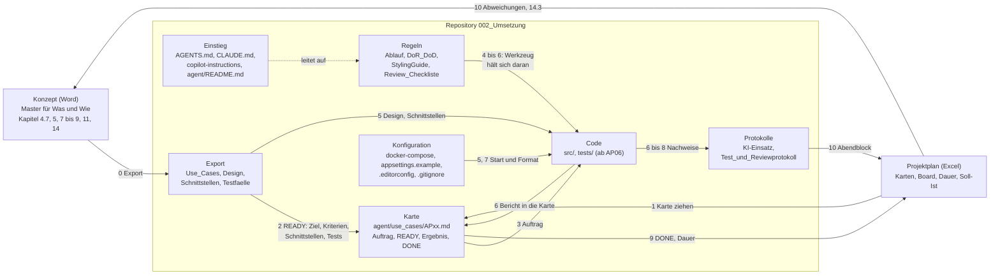
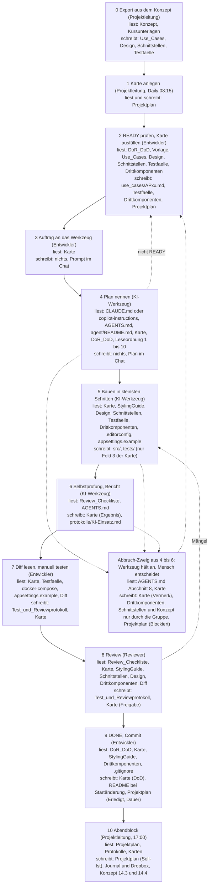

# Übersicht: wie das Setup zusammenhängt, welche Phase welche Dateien liest und schreibt

Erhoben am 22.09.2026 aus den Dateien dieses Ordners und gegen den Ordner geprüft (22 Dateien, alle zugeordnet, keine erfunden). Drei Sichten: der Dokumentfluss zwischen den Dateigruppen, die Phasen mit ihren Dateien, und die Tabelle mit allen Einzelheiten. Wer wann was tut, steht in `Ablauf.md`; das Bild dazu liegt im Projektordner `bilder\umsetzung\053_agent_setup.html` (Archify) und `bilder\umsetzung\052_ablauf_je_karte.png`.

## 1. Dokumentfluss: die Dateigruppen und was zwischen ihnen fliesst

Das Konzept (Word) und der Projektplan (Excel) liegen ausserhalb des Repositorys und bleiben die Master. Im Repository gibt es sechs Gruppen: Einstieg, Regeln, Export, Karte, Code, Protokolle, dazu die Konfiguration.

Lesart: Nach links kommt nur, was ein Mensch entschieden hat (DONE, Abweichungen). Das Werkzeug schreibt nie in Konzept, Plan, Regeln oder Export; es schreibt Code, den Ergebnisabschnitt der Karte und eine Zeile im KI-Einsatz.

## 2. Phasen mit ihren Dateien

## 3. Tabelle: jede Phase, jede Datei

| Nr. | Phase | Wer | Liest | Schreibt oder ergänzt |
|---|---|---|---|---|
| 0 | Export aus dem Konzept | Projektleitung, nach jeder Konzeptänderung | Konzept (Word), Kursunterlagen | `Use_Cases.md`, `Design.md`, `Schnittstellen.md`, `Testfaelle.md` (Gerüst; danach lebend) |
| 1 | Karte anlegen oder aus dem Plan ziehen | Projektleitung, Daily 08:15 | Projektplan | Projektplan: Zeile, Verantwortlicher, Board In Arbeit |
| 2 | READY prüfen, Karte ausfüllen | Entwickler (Karteninhaber) | `DoR_DoD.md`, `Use_Case_Karte_Vorlage.md`, `Use_Cases.md`, `Design.md`, `Schnittstellen.md`, `Testfaelle.md`, `Drittkomponenten.md`, Projektplan | `use_cases/APxx.md` (neu); `Testfaelle.md` (neue Fälle); `Drittkomponenten.md` (neue Abhängigkeit vor dem Bauen); Projektplan |
| 3 | Auftrag an das Werkzeug | Entwickler | `use_cases/APxx.md` | nichts; der Prompt steht im Chat, Beispiel in `use_cases/AP07-backend-senden.md` |
| 4 | Plan nennen, auf Zustimmung warten | KI-Werkzeug | `CLAUDE.md` oder `.github/copilot-instructions.md`, `AGENTS.md`, `README.md` (agent), Karte, `DoR_DoD.md`; die Leseordnung 1 bis 10 | nichts; Plan im Chat. Nicht READY: Stopp |
| 5 | Bauen in kleinsten Schritten | KI-Werkzeug | Karte, `StylingGuide.md`, `Design.md`, `Schnittstellen.md`, `Testfaelle.md`, `Drittkomponenten.md`, `.editorconfig`, `appsettings.example.json` | `src/`, `tests/`: nur Dateien aus Feld 3 der Karte. Gesperrt: `docker_compose.yml`, `appsettings*.json`, `.csproj`, `global.json`, andere Schichten |
| 6 | Selbstprüfung, Bericht, Diff | KI-Werkzeug | `Review_Checkliste.md`, `AGENTS.md` Abschnitt 9 | Karte, Abschnitt Ergebnis; `protokolle/KI-Einsatz.md` |
| 7 | Diff lesen, starten, manuell testen | Entwickler | Karte, `Testfaelle.md`, `docker_compose.yml`, `appsettings.example.json`, Diff in `src/` und `tests/` | `protokolle/Test_und_Reviewprotokoll.md`; Karte: Manuell geprüft |
| 8 | Review und Freigabe | Reviewer (anderes Mitglied) | `Review_Checkliste.md`, Karte, `StylingGuide.md`, `Schnittstellen.md`, `Design.md`, `Drittkomponenten.md`, Diff | `protokolle/Test_und_Reviewprotokoll.md` (Review-Zeile); Karte: Freigabe. Mängel: zurück zu 5 |
| 9 | DONE, Commit, Board Erledigt | Entwickler | `DoR_DoD.md`, Karte, `StylingGuide.md`, `Drittkomponenten.md`, `.gitignore` | Karte: DoD-Kästchen; `README.md` (Root) bei Start- oder Installationsänderung; Projektplan: Erledigt, Dauer effektiv; Commit `APxx: ...` |
| 10 | Abendblock: Soll-Ist, Journal | Projektleitung, 17:00 | Projektplan, Protokolle, Karten | Projektplan (Soll-Ist), Journal und Dropbox, Konzept 14.3 und 14.4 |
| Abbruch | Werkzeug hält an, Mensch entscheidet | KI-Werkzeug, dann Entwickler oder Gruppe | `AGENTS.md` Abschnitt 8, Karte, `Drittkomponenten.md`, `Schnittstellen.md` | Karte (Vermerk); `Drittkomponenten.md` bei Freigabe; `Schnittstellen.md` und Konzept nur durch die Gruppe; Projektplan: Blockiert |

## 4. Dateigruppen und wer sie ändern darf

| Gruppe | Dateien | Ändert |
|---|---|---|
| Einstieg | `AGENTS.md`, `CLAUDE.md`, `.github/copilot-instructions.md`, `README.md` (Root und agent) | Gruppe, mit Zeile im Reviewprotokoll |
| Regeln | `Ablauf.md`, `DoR_DoD.md`, `StylingGuide.md`, `Review_Checkliste.md` | Gruppe, mit Zeile im Reviewprotokoll |
| Export | `Use_Cases.md`, `Design.md`, `Schnittstellen.md` | Konzept ändern, neu exportieren (Projektleitung); Schnittstellen zusammen mit dem Konzept |
| Lebend | `Testfaelle.md`, `Drittkomponenten.md`, `use_cases/`, `protokolle/` | Karteninhaber, Reviewer, Werkzeug (nur Ergebnisabschnitt der Karte und KI-Einsatz); nur ergänzen, nie leeren |
| Konfiguration | `docker_compose.yml`, `appsettings.example.json`, `.editorconfig`, `.gitignore` | Gruppe in AP06; danach nur über eine Karte, die die Datei nennt |
| Code | `src/`, `tests/` (entstehen in AP06) | Werkzeug und Entwickler, nur innerhalb einer Karte |
| Extern | Konzept (Word), Projektplan (Excel), Kursunterlagen, Journal und Dropbox | Gruppe beziehungsweise Projektleitung; das Werkzeug nie |
