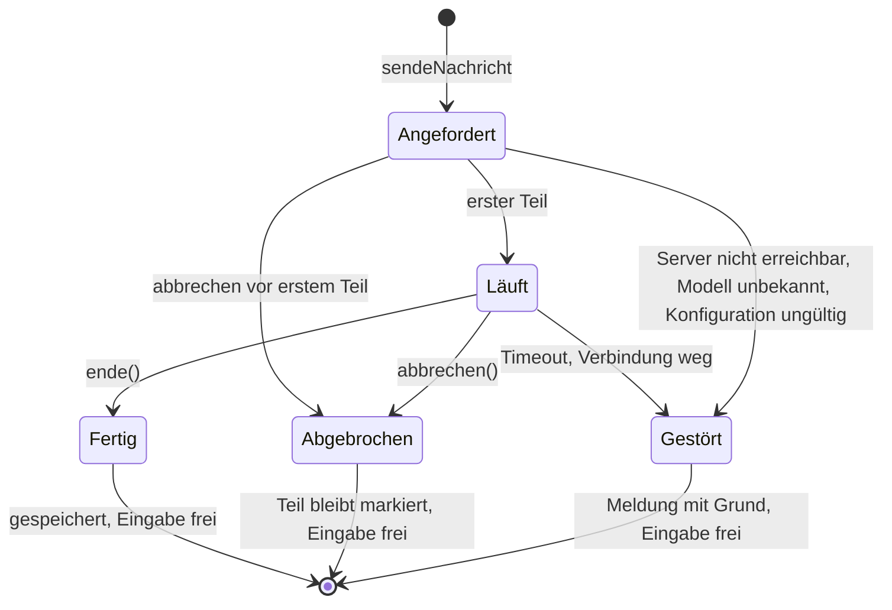

# Was gebaut wird: Funktionen, Anforderungen, Haupt-Use-Case, Ziele

> Auszug aus dem Konzept `20260921-010-RL-Konzept.docx` fuer Entwickler und KI-Werkzeuge. Das Konzept ist der Master; weicht die Umsetzung ab, wird zuerst das Konzept geaendert (Kapitel 14.3) und dann dieser Auszug neu exportiert. Stand des Exports: siehe Dateidatum.

## Funktionsliste

Je Funktion ein Ziel eines Akteurs, lösungsneutral, prüfbar. Spalte Priorität nennt die Umsetzungsreihenfolge, keinen Rang.

| Nr. | Funktion | Beschreibung | Ziel | Priorität |
|----|----|----|----|----|
| F01 | Nachricht senden und Antwort erhalten | Benutzer sendet eine Nachricht; das System leitet sie mit dem Verlauf an das lokale Modell weiter und zeigt die Antwort schrittweise im Chat an. Leere Eingabe wird nicht gesendet, zu lange abgewiesen. | Z01, Z02, Z03 | 1 |
| F02 | Laufende Antwort abbrechen | Benutzer bricht eine laufende Antwort ab; der gelieferte Teil bleibt sichtbar; danach ohne Neustart weiterarbeiten. | Z03 | 1 |
| F03 | Neue Unterhaltung beginnen | Benutzer startet eine neue leere Unterhaltung; bestehende bleiben erhalten. | Z05 | 2 |
| F04 | Frühere Unterhaltung öffnen | Gespeicherte Unterhaltungen sind gelistet und können auch nach einem Neustart geöffnet werden. | Z05 | 2 |
| F05 | Unterhaltung löschen | Benutzer löscht eine ausgewählte Unterhaltung vollständig. | Z05 | 2 |
| F06 | Störung erkennen und melden | Das System erkennt Modellserver nicht erreichbar, unbekanntes Modell, ungültige Konfiguration und Zeitüberschreitung und zeigt eine verständliche Meldung; die Anwendung bleibt bedienbar. | Z06 | 2 |
| F07 | Konfiguration ändern (Betreiber) | Modellserver-Adresse, Modellname, Systemanweisung und Laufzeitparameter werden ausserhalb des Sourcecodes geändert; Beispielkonfiguration nur mit Platzhaltern. | Z02 | 1 |
| F08 | Technisches Protokoll einsehen (Betreiber) | Das System hält Zeitpunkt, Art, Dauer und Fehler jeder Anfrage fest, ohne Chattext; der Betreiber kann es lesen. (Ergänzt 21.09.2026, damit Z07 eine Funktion hat.) | Z07, Z06 | 3 |

Tabelle : Funktionsliste F01 bis F08

## Nichtfunktionale Anforderungen

| Nr. | Anforderung | Beschreibung | Ziel |
|----|----|----|----|
| NF01 | Lokale Verarbeitung | Chatnachrichten und Antworten bleiben auf dem Referenzgerät. Kein externer KI-Dienst wird verwendet. | Z01 |
| NF02 | Entkoppelte Architektur | Frontend kommuniziert nur mit dem Backend. Der Modellserver ist gekapselt und austauschbar. | Z02 |
| NF03 | Streaming | Antworten werden schrittweise angezeigt, während sie erzeugt werden. | Z03 |
| NF04 | Responsive Bedienung | Die Oberfläche bleibt bei Desktop- und Mobilbreite vollständig bedienbar. | Z04 |
| NF05 | HFU Corporate Design | Das Frontend verwendet die bereitgestellten Gestaltungselemente der HFU konsistent. | Z04 |
| NF06 | Persistenz | Unterhaltungen bleiben lokal gespeichert und stehen nach einem Neustart wieder zur Verfügung. | Z05 |
| NF07 | Fehlertoleranz | Nach einem behandelten Fehler bleibt die Anwendung weiter verwendbar. | Z06 |
| NF08 | Datenschutz im Logging | Technische Logs enthalten standardmässig keine vollständigen Chattexte. | Z07 |

Tabelle : Nichtfunktionale Anforderungen

## Haupt-Use-Case als Text

| Feld | Inhalt |
|----|----|
| Name | Nachricht senden und Antwort erhalten (F01) |
| Umfang | Lokaler KI-Chat (Frontend, Backend, Modellserver auf dem Referenzsystem) |
| Ebene | Anwenderziel |
| Primärakteur | Chat-Benutzer (Studierende, Dozierende) |
| Stakeholder und Interessen | Chat-Benutzer: will schnell eine brauchbare Antwort und die Antwort abbrechen können. Betreiber: will, dass Störungen sichtbar und nachvollziehbar sind, ohne Chattexte im Protokoll. Schule: will, dass keine Nachricht das Gerät verlässt. |
| Vorbedingung | Die Anwendung läuft, der Modellserver ist erreichbar, die Konfiguration ist gültig, eine Unterhaltung ist geöffnet (neu oder geladen). |
| Erfolgsgarantie (Nachbedingung) | Frage und vollständige Antwort stehen in der Unterhaltung, sind lokal gespeichert und nach einem Neustart wieder sichtbar. Das technische Protokoll hat einen Eintrag ohne Chattext. Die Eingabe ist wieder frei. |
| Minimalgarantie | Auch bei Störung oder Abbruch bleibt die Anwendung bedienbar, und der Benutzer weiss, was passiert ist. |
| Auslöser | Der Benutzer sendet einen Text. |

Tabelle : Haupt-Use-Case F01 als Text

### Standardablauf

1.  Der Benutzer gibt einen Text in das Eingabefeld ein und sendet ihn.

2.  Das System prüft die Eingabe (nicht leer, nicht länger als die konfigurierte Grenze) und zeigt die Nachricht in der Unterhaltung an.

3.  Das System übergibt die Nachricht zusammen mit dem bisherigen Verlauf und der Systemanweisung an das konfigurierte Modell.

4.  Das Modell liefert die Antwort in Teilen; das System zeigt jeden Teil sofort in der Unterhaltung an und sperrt die Eingabe, bis die Antwort endet.

5.  Das Ende der Antwort wird erkannt; das System markiert die Antwort als vollständig, speichert Frage und Antwort in der Unterhaltung und schreibt einen Protokolleintrag (Zeitpunkt, Dauer bis erstes Wort, Gesamtdauer, kein Text).

6.  Die Eingabe ist wieder frei. Der Use Case endet.

### Erweiterungen

- 2a Eingabe leer: Das System sendet nichts und zeigt einen kurzen Hinweis. Weiter bei 1.

- 2b Eingabe länger als die Grenze: Das System weist die Eingabe ab und nennt die Grenze. Weiter bei 1.

- 3a Modellserver nicht erreichbar: Das System zeigt «Modellserver nicht erreichbar, bitte Betreiber informieren», die Nachricht bleibt in der Eingabe erhalten. Weiter bei 1.

- 3b Modell unbekannt oder Konfiguration ungültig: Das System zeigt eine Meldung mit dem betroffenen Konfigurationswert. Weiter bei 1.

- 4a Der Benutzer bricht ab (F02): Das System stoppt die Erzeugung, der bereits gelieferte Teil bleibt sichtbar und ist als abgebrochen markiert, die Eingabe ist frei. Ende.

- 4b Zeitüberschreitung oder Verbindung zum Modellserver bricht ab: Das System markiert die Antwort als gestört, zeigt den Grund, die Eingabe ist frei. Ende.

### Spezielle Anforderungen

Die Antwort erscheint schrittweise, während sie entsteht (M06). Keine Chattexte im technischen Protokoll (M12). Alle Verarbeitung auf dem Referenzsystem (M04).

### Bezug zum System

F01 ist der Kern, der im Systemkontext (4.5) als einziges Oval steht. Er erfüllt Z01 (lokal), Z02 (Kapselung, weil Schritt 3 nur «das konfigurierte Modell» kennt) und Z03 (schrittweise, abbrechbar). Die Erweiterungen 3a, 3b und 4b sind die Störfälle von Z06, der Protokolleintrag in Schritt 5 ist Z07. Die Systemoperationen, die das Design in Kapitel 7 verteilt, sind sendeNachricht und abbrechen; alles andere sind Antworten des Systems.

### Systemsequenzdiagramm

Das System bleibt Black-Box; Akteure sind der Chat-Benutzer und der Modellserver als Fremdsystem. Die Schleife zeigt das Streaming, die Alternative den Abbruch.

Diagramm: Systemsequenzdiagramm F01 mit Streaming-Schleife und Abbruch (im Konzept als Bild, hier als Mermaid; Datei `044_ssd_f01.png` im Ordner bilder des Projekts)

```mermaid
sequenceDiagram
    actor B as Chat-Benutzer
    participant S as Lokaler KI-Chat (System)
    participant M as Modellserver (Fremdsystem)
    B->>S: 1 sendeNachricht(text)
    S-->>B: 2 eingabeGeprüft (leer? zu lang?)
    S->>M: 3 anfrage(verlauf, systemanweisung, modellname)
    loop bis Antwort vollständig
        M-->>S: 4 antwortTeil(text)
        S-->>B: 5 zeigeTeil(text)
    end
    M-->>S: 6 ende()
    S-->>B: 7 antwortVollständig(), gespeichert
    alt Benutzer bricht ab, während die Schleife läuft
        B->>S: 4a abbrechen()
        S->>M: 4b abbruch()
        S-->>B: 4c teilantwortMarkiert(), Eingabe frei
    end
```

### Zustände der Antwort

Diagramm: Zustandsdiagramm einer Antwort. Jeder Endzustand lässt die Anwendung weiter benutzbar. (im Konzept als Bild, hier als Mermaid; Datei `045_zustand_antwort.png` im Ordner bilder des Projekts)

## Ziele an das System: MUSS, KANN, NICHT

Ein Ziel ist ein erreichter Zustand mit Nachweis.

Die Spalte Priorität nennt die Umsetzungsreihenfolge (1 zuerst), alle MUSS-Ziele bleiben MUSS.

### MUSS

| Nr. | Ziel | Nachweis | Quelle | Priorität |
|----|----|----|----|----|
| Z01 | Der Chat beantwortet Anfragen vollständig lokal, keine Nachricht verlässt das Referenzgerät. | Internet getrennt, fünf Anfragen nacheinander beantwortet, kein Aufruf eines externen Dienstes. | M04 | 1 |
| Z02 | Das Frontend kennt nur die Backend-Schnittstelle. Modellserver, Modellname und Systemanweisung sind ohne Codeänderung austauschbar. | Schnittstelle ist dokumentiert; eine Änderung von API-Adresse, Modellname oder Systemanweisung in der Konfigurationsdatei wirkt ohne Neubau. | M05 | 1 |
| Z03 | Der Benutzer sieht die Antwort während der Erzeugung und kann sie abbrechen, ohne die Anwendung neu zu starten. | Antwort erscheint schrittweise; nach einem Abbruch funktioniert die nächste Frage. | M06 | 2 |
| Z04 | Die Oberfläche trägt das Corporate Design der HFU und ist bei Desktop- und Mobilbreite vollständig bedienbar. | Abnahme bei zwei festgelegten Fensterbreiten, kein Hauptbedienelement verdeckt. | M07 | 2 |
| Z05 | Unterhaltungen bleiben lokal erhalten, überleben einen Neustart und sind einzeln löschbar. | Fünf Unterhaltungen anlegen, Anwendung neu starten, alle da, eine über die Oberfläche löschen, sie ist weg. | M08 | 2 |
| Z06 | Bei einer Störung erhält der Benutzer eine verständliche Meldung und kann weiterarbeiten. | Vier Negativtests: Modellserver weg, Modell unbekannt, Konfiguration ungültig, Zeitüberschreitung; je Meldung sichtbar und danach Weiterbetrieb. | M09 | 2 |
| Z07 | Technische Logs enthalten keine vollständigen Chattexte. | Drei Testanfragen, danach Logprüfung; ein Abschnitt beschreibt, welche Daten wo und wie lange liegen. | M12 | 1 |

Tabelle : Mussziele

### KANN

| Nr. | Ziel |
|----|----|
| K01 | Der Benutzer wechselt im Betrieb zwischen zwei lokalen Modellen; beide bestehen denselben Basistest mit fünf Fragen. |
| K02 | Eine Unterhaltung lässt sich als lesbare Datei exportieren und nach Neustart verlustfrei importieren. |
| K03 | Lokale Rollen Benutzer und Administrator; Modelladresse und Systemanweisung ändert nur der Administrator. |
| K04 | Suche in 5 bis 20 Schuldokumenten mit Quellenangabe bei 12 von 15 Wissensfragen. |
| K05 | Eine Pipeline baut aus einem freigegebenen Stand das Installationspaket und bricht bei fehlschlagendem Test ab. |
| K06 | Ein zweites Gerät im lokalen Netz nutzt das Frontend; zwei parallele Anfragen stürzen nicht ab. |
| K07 | Eine Administrationsansicht zeigt Modellstatus, laufende Anfragen, letzte Fehler und Speicherverbrauch ohne Seitenneustart. |
| K08 | Zweites Betriebssystem mit vollständiger Probeinstallation und fünf Basistests. |

Tabelle : Kannziele

### NICHT

| Nr. | Ziel |
|----|----|
| N01 | Training oder Fine-Tuning eines Sprachmodells |
| N02 | Produktiver Mehrbenutzerbetrieb (Prototyp auf einem Referenzgerät, Entscheidungsgrundlage) |
| N03 | Hochverfügbarkeit und Skalierung über mehrere Server |
| N04 | Anbindung an das Identitätsmanagement der Schule |
| K05 | Betrieb über das Internet |
| N06 | Websuche durch das Modell |
| N07 | Ausführung von Betriebssystembefehlen oder Werkzeugen durch das Modell |
| N08 | RAG oder Vektordatenbank |
| N09 | Unterstützung aller Betriebssysteme |
| N10 | Betrieb auf einem zentralen Schulserver |
| N11 | Zugriff auf produktive Schuldaten |

Tabelle : Nichtziele

